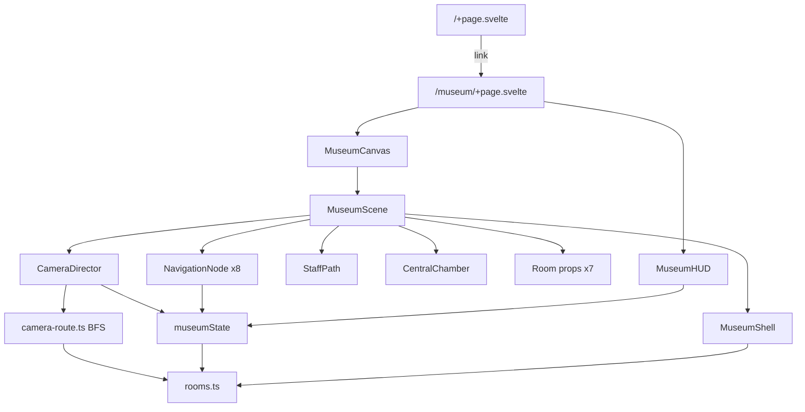

# Agent context — Personal / Museum

Read this before changing the museum or monorepo. Detailed camera/layout authoring lives in [`docs/CAMERA_AND_LAYOUT.md`](./docs/CAMERA_AND_LAYOUT.md). Human overview: [`README.md`](./README.md).

## What this repo is

npm workspaces monorepo (`apps/*`, `packages/*`). **Only app:** `@portfolio/museum` — Threlte/Three Chopin museum graybox.

“Camera” means **3D guided PerspectiveCamera navigation**, not webcam/video.

Root scripts: `npm run dev` / `build` / `check` target museum only.

## Architecture (museum)



**Single source of truth for space + tour:** `apps/museum/src/lib/content/rooms.ts`

**Architecture materials:** `apps/museum/src/lib/content/materials.ts` + `MuseumMaterial.svelte` (texture cache/variants). Preview at `/dev/materials`. Shell floors/walls/ceilings use semantic `Floor` / `Wall` / `Ceiling` planes — do not reintroduce large textured boxes for major faces.

**Paris asset slice:** `apps/museum/src/lib/content/assets.ts` owns model provenance/defaults; `paris-salon-layout.ts` owns local placement transforms; `AssetModel.svelte` owns cached loading, cloning, and fallbacks. Preview at `/dev/assets`. Source models/licences live under `assets-source/`; only optimized GLBs under `static/museum/models/` load in production.

| Concern | Owns |
|---------|------|
| Room poses, dims, openings, colors | `museumRooms` |
| Shared PBR catalogue + tile sizes | `materials.ts` |
| Model provenance, defaults, licence status | `assets.ts` |
| Paris object transforms | `paris-salon-layout.ts` |
| Stops: eye position + look target | `navigationNodes` |
| Edge polylines + clearance | `navigationConnections` |
| Local → world (yaw) | `roomPoint()` |
| Shell cutouts / portals | `MuseumShell.svelte` (derives from rooms) |
| Path motion | `camera-route.ts` → `CameraDirector.svelte` |
| Tour rules / FSM | `museum-state.svelte.ts` |
| Types | `lib/types/museum.ts` |

Do **not** reintroduce parallel shell builders, hand-traced paths disconnected from `navigationConnections`, or a second nav graph.

## Key paths

```
apps/museum/src/
  routes/+page.svelte              landing
  routes/museum/+page.svelte       immersive page
  routes/dev/materials/+page.svelte material preview
  routes/dev/assets/+page.svelte   model preview / inspector
  lib/content/rooms.ts             DATA: rooms, nodes, connections
  lib/content/materials.ts         DATA: PBR material catalogue
  lib/content/assets.ts            DATA: model manifest + licence metadata
  lib/content/paris-salon-layout.ts DATA: Paris-local object transforms
  lib/types/museum.ts              museum types
  lib/types/materials.ts           material types
  lib/state/museum-state.svelte.ts tour FSM
  lib/museum/MuseumCanvas.svelte   Threlte canvas
  lib/museum/MuseumScene.svelte    scene assembly
  lib/museum/materials/
    MuseumMaterial.svelte          shared MeshStandardMaterial + tiling
    texture-cache.ts               load/cache/clone/release textures
    surfaces/Floor|Wall|Ceiling    UV-safe architecture planes
  lib/museum/assets/
    AssetModel.svelte              cached GLB load + safe clone + fallback
    AssetFallback.svelte           dimensioned primitive fallbacks
  lib/museum/navigation/
    CameraDirector.svelte          camera + easing + keys
    camera-route.ts                BFS + waypoints → route
    NavigationNode.svelte          clickable spheres
  lib/museum/layout/
    MuseumShell.svelte             procedural walls/floors
    CentralChamber.svelte          circular floor + piano
    StaffPath.svelte               floor ribbons from connections
    RoomPortal.svelte              door frames
  lib/museum/rooms/*.svelte        graybox props per room
  lib/museum/ui/MuseumHUD.svelte   DOM overlay
  static/textures/                 placeholder tile maps (plaster/wood/brass)
```

## Runtime contracts

- **Guided mode:** only `nextNodeId`, or `previousNodeId` if that room was visited.
- **Free mode:** any other node; routes still follow graph edges (multi-hop BFS).
- **During transition:** no new navigation (`isTransitioning`).
- **Reduced motion:** skip path animation (instant).
- **Music chamber genre portals** in `MusicChamber.svelte` are decorative — not navigation.
- **`@portfolio/scroll-travel`** is a museum dependency but **unused**; do not wire it in unless intentionally switching to scroll/section travel.
- **`audioEnabled`** on state is unused; shared audio/cursor/HUD packages are for missing portfolio apps.
- Paris hero loading begins in Departure or whenever the active camera route crosses Paris; repeated models reuse the per-Canvas GLTF cache and clone scenes/materials per instance.

## Conventions for agents

1. Prefer editing `rooms.ts` for layout/path/tour changes; keep shell and camera as consumers.
2. Eye height for path waypoints is typically **1.65**; look targets often ~1.0–1.5.
3. Keep `clearance` honest (~0.35); it drives corner fillet radius in `CameraDirector`.
4. Match door openings in room data to path waypoints that pass through those openings — no collision system will save bad waypoints.
5. Svelte 5 runes only (`$state` / `$derived` / `$effect` / `$props`). Follow existing Threlte patterns.
6. Stay graybox unless asked for art: primitives; use shared `MuseumMaterial` for architecture surfaces.
7. For Paris model changes, update `assets.ts` for provenance/defaults and `paris-salon-layout.ts` for transforms; do not add room-local GLTF loaders.
8. Root `dev` / `build` / `check` already target museum only.
9. No commits unless the user requests them.

## Known limitations (do not assume fixed)

No collision/navmesh · no free-look at rest · selective shadows and GLTF assets only in Paris · no exhibit interaction · no spatial audio · `targetWaypoints` typed but unused (look synthesized) · `lockInteraction` unused in data · mobile hides route list · camera can clip walls if waypoints are wrong.

Full authoring checklist and limits: [`docs/CAMERA_AND_LAYOUT.md`](./docs/CAMERA_AND_LAYOUT.md).
