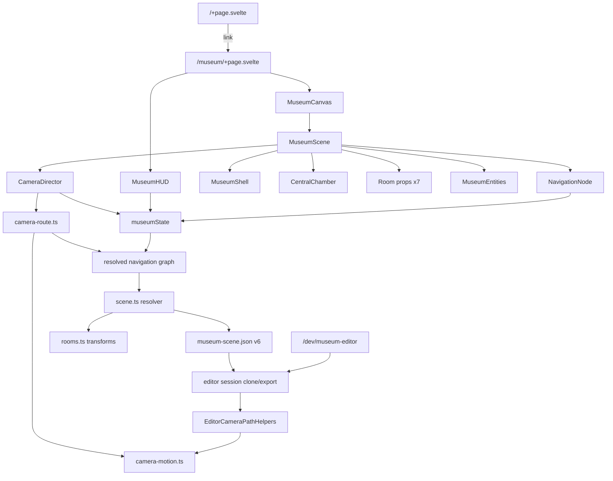

# Agent context — Personal / Museum

Read this before changing the museum or monorepo. Detailed camera/layout authoring lives in [`docs/CAMERA_AND_LAYOUT.md`](./docs/CAMERA_AND_LAYOUT.md). Human overview: [`README.md`](./README.md).

## What this repo is

npm workspaces monorepo (`apps/*`, `packages/*`). **Only app:** `@portfolio/museum` — Threlte/Three Chopin museum graybox.

“Camera” means **3D guided PerspectiveCamera navigation**, not webcam/video.

Root scripts: `npm run dev` / `build` / `check` target museum only.

## Architecture (museum)



**Editable scene and tour source:** `apps/museum/src/lib/content/museum-scene.json`.

**Static architecture source:** `apps/museum/src/lib/content/rooms.ts`. It owns room poses, dimensions, openings, colors, and local/world yaw transforms. It does not own placements, navigation nodes, or connections.

**Scene boundary:** `scene-codec.ts` strictly accepts v1–v6 and returns canonical v6; `scene.ts` resolves room-local values and inserts fresh connection endpoints. Never persist generated endpoint anchors.

**Architecture materials:** `apps/museum/src/lib/content/materials.ts` + `MuseumMaterial.svelte` (texture cache/variants). Preview at `/dev/materials`. Shell floors/walls/ceilings use semantic `Floor` / `Wall` / `Ceiling` planes — do not reintroduce large textured boxes for major faces.

**Paris asset slice:** `apps/museum/src/lib/content/assets.ts` owns model provenance/defaults; scene JSON owns placement transforms; `AssetModel.svelte` owns cached loading, cloning, and fallbacks. Preview at `/dev/assets`. Source models/licences live under `assets-source/`; only optimized GLBs under `static/museum/models/` load in production.

For the asset handoff workflow and optimization checklist, see [`docs/ASSET_WORKFLOW.md`](./docs/ASSET_WORKFLOW.md).

| Concern | Owner |
|---------|-------|
| Room poses, dimensions, openings, colors | `rooms.ts` → `museumRooms` |
| Local ↔ world yaw transforms / room containment | `rooms.ts` |
| Textures, material instances, entities, nodes, tour links, connection paths | `museum-scene.json` v6 |
| Strict v1–v6 validation, migration, serialization | `scene-codec.ts` |
| Runtime local → world resolution + generated endpoints | `scene.ts` |
| Shared PBR catalogue + tile sizes | `materials.ts` |
| Model provenance, defaults, licence status | `assets.ts` |
| Shell cutouts / portals | `MuseumShell.svelte` (derives from rooms) |
| BFS, edge orientation, path-part assembly, exact-edge routes | `camera-route.ts` |
| Three.js curves, timing, easing, projection, sampling | `camera-motion.ts` |
| Tour eligibility / FSM | `museum-state.svelte.ts` |
| Editor session, history, topology commands | `museum-editor.svelte.ts` |
| Editor-only curve display and picking | `EditorCameraPathHelpers.svelte` |
| Types | `lib/types/museum.ts` + `content/scene.ts` |

Do **not** reintroduce navigation arrays in `rooms.ts`, parallel scene/layout modules, hand-traced component paths, persisted connection endpoints, or a second nav graph/motion implementation.

## Key paths

```
apps/museum/src/
  routes/+page.svelte                 landing
  routes/museum/+page.svelte          immersive visitor page
  routes/dev/materials/+page.svelte   material preview
  routes/dev/assets/+page.svelte      model preview / inspector
  routes/dev/museum-editor/+page.svelte development-only editor
  lib/content/rooms.ts                DATA: static room architecture/transforms
  lib/content/museum-scene.json       DATA: resources + entities + navigation schema v6
  lib/content/scene-codec.ts          strict v1–v6 codec + deterministic migration
  lib/content/scene.ts                document types + runtime resolver/graph
  lib/content/materials.ts            DATA: PBR material catalogue
  lib/content/assets.ts               DATA: model manifest + licence metadata
  lib/state/museum-state.svelte.ts    visitor tour FSM
  lib/editor/museum-editor.svelte.ts  editor session/history/commands
  lib/editor/editor-camera-path.ts    pure path authoring helpers
  lib/editor/EditorCameraPathHelpers.svelte editor-only curves/anchors/picking
  lib/museum/MuseumCanvas.svelte      Threlte canvas
  lib/museum/MuseumScene.svelte       visitor/editor-shared scene assembly
  lib/museum/MuseumEntities.svelte     scene entity renderer (model/primitive/light)
  lib/museum/MuseumAssets.svelte       thin alias → MuseumEntities
  lib/museum/entities/                 EntityPrimitive / EntityLight mounts
  lib/museum/materials/
    MuseumMaterial.svelte             shared MeshStandardMaterial + tiling
    texture-cache.ts                  load/cache/clone/release textures
    surfaces/Floor|Wall|Ceiling       UV-safe architecture planes
  lib/museum/assets/
    AssetModel.svelte                 cached GLB load + safe clone + fallback
    AssetFallback.svelte              dimensioned primitive fallbacks
  lib/museum/navigation/
    CameraDirector.svelte             visitor camera + Paris free-look
    camera-route.ts                   graph routes → typed position parts/targets
    camera-motion.ts                  shared curves/timing/sampling
    NavigationNode.svelte             clickable visitor spheres
  lib/museum/layout/
    MuseumShell.svelte                procedural walls/floors
    CentralChamber.svelte             circular floor + piano
    RoomPortal.svelte                 door frames
  lib/museum/rooms/*.svelte           graybox room props
  lib/museum/ui/MuseumHUD.svelte      DOM overlay
  static/textures/                    placeholder tile maps
```

## Scene and path contracts

- Scene JSON v2+ connections persist only stable-ID **interior** anchors under `positionPath`.
- `rounded-polyline` preserves legacy line/quadratic fillet motion; `clearance` caps its corner radius.
- `auto-bezier` passes through endpoints/interior anchors with derived centripetal Catmull–Rom tangents. Controls are not persisted or exposed.
- Anchors with `roomId` are room-local; anchors without it are world-space.
- Resolver inserts fresh `node:<nodeId>:position` endpoints in world space. Endpoint IDs may not be used by interior anchors.
- `camera-route.ts` reverses edge anchors when needed, coalesces consecutive rounded parts for legacy parity, and retains auto paths as separate parts.
- `camera-motion.ts` is the only curve constructor. Visitor motion, editor path visuals/picking, and preview must use its shared position curve.
- Look targets remain synthesized; `targetWaypoints` is still unused.

## Runtime contracts

- **Guided mode:** only `nextNodeId`, or `previousNodeId` if that room was visited.
- **Free mode:** any other node; routes still follow graph edges through multi-hop BFS.
- **Free-only nodes:** v2+ nodes with neither guided link remain graph-reachable in free mode. Nodes must define both `nextNodeId` and `previousNodeId`, or neither; guided nodes form one reciprocal cycle.
- **During transition:** no new navigation (`isTransitioning`).
- **Reduced motion:** skip path animation (instant).
- Visitor `/museum` renders no route ribbons, path lines, anchors, or editor helpers.
- **Music chamber genre portals** in `MusicChamber.svelte` are decorative — not navigation.
- **`@portfolio/scroll-travel`** is a museum dependency but **unused**; do not wire it in unless intentionally switching to scroll/section travel.
- **`audioEnabled`** on state is unused; shared audio/cursor/HUD packages are for missing portfolio apps.
- Paris hero loading begins in Departure or whenever the active camera route crosses Paris; repeated models reuse the per-Canvas GLTF cache and clone scenes/materials per instance.
- At the stable Paris stop, `CameraDirector` keeps the authored eye position but permits clamped mouse/arrow free-look. During transitions and in every other room, guided camera remains authoritative.
- `/dev/museum-editor` is development-only. Production must return 404 and exclude real editor modules from visitor chunks.

## Conventions for agents

1. Edit `rooms.ts` for architecture. Edit/export `museum-scene.json` for entities, nodes, paths, and tour data.
2. Keep persisted connection anchors interior-only and stable-ID based; let resolver derive endpoints.
3. Prefer room-local anchors for room-owned geometry. Use `roomPoint()` / `roomLocalPoint()`; respect yaw-aware containment.
4. Eye height is typically **1.65 m**; target height typically **1.25 m**; default target distance **3 m**; default clearance **0.35 m**.
5. Match openings to authored curves and preview every edge both ways — no collision system will save bad anchors.
6. Preserve legacy `rounded-polyline` paths unless deliberately converting them to `auto-bezier` and visually checking clearance.
7. Svelte 5 runes only (`$state` / `$derived` / `$effect` / `$props`). Follow existing Threlte patterns.
8. Keep editor helpers outside `MuseumScene` and visitor imports. One shared motion builder and one navigation graph only.
9. For Paris models, update `assets.ts` for provenance/defaults and scene JSON/editor for placement transforms; do not add room-local GLTF loaders.
10. Root `dev` / `build` / `check` already target museum only.
11. No commits unless user requests them.

## Known limitations (do not assume fixed)

No collision/navmesh · synthesized look path only · fixed-eye free-look only at Paris stop · selective shadows/GLTF assets only in Paris · no exhibit interaction · no spatial audio · no tangent handles · no per-edge timing · timeline drag-connect creates at most one missing edge · guarded topology deletion only · `targetWaypoints` typed but unused · `lockInteraction` unused in checked-in data · mobile hides route list · curves can clip walls if anchors are wrong.

Full authoring checklist and limits: [`docs/CAMERA_AND_LAYOUT.md`](./docs/CAMERA_AND_LAYOUT.md).
