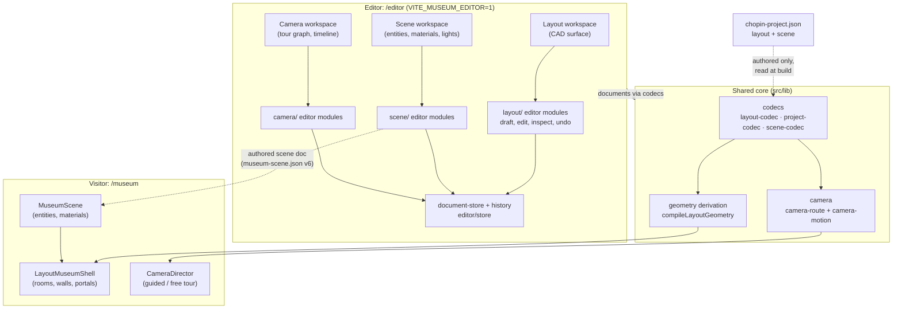
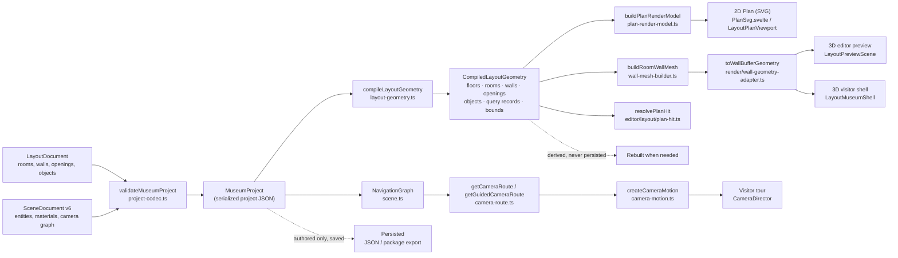
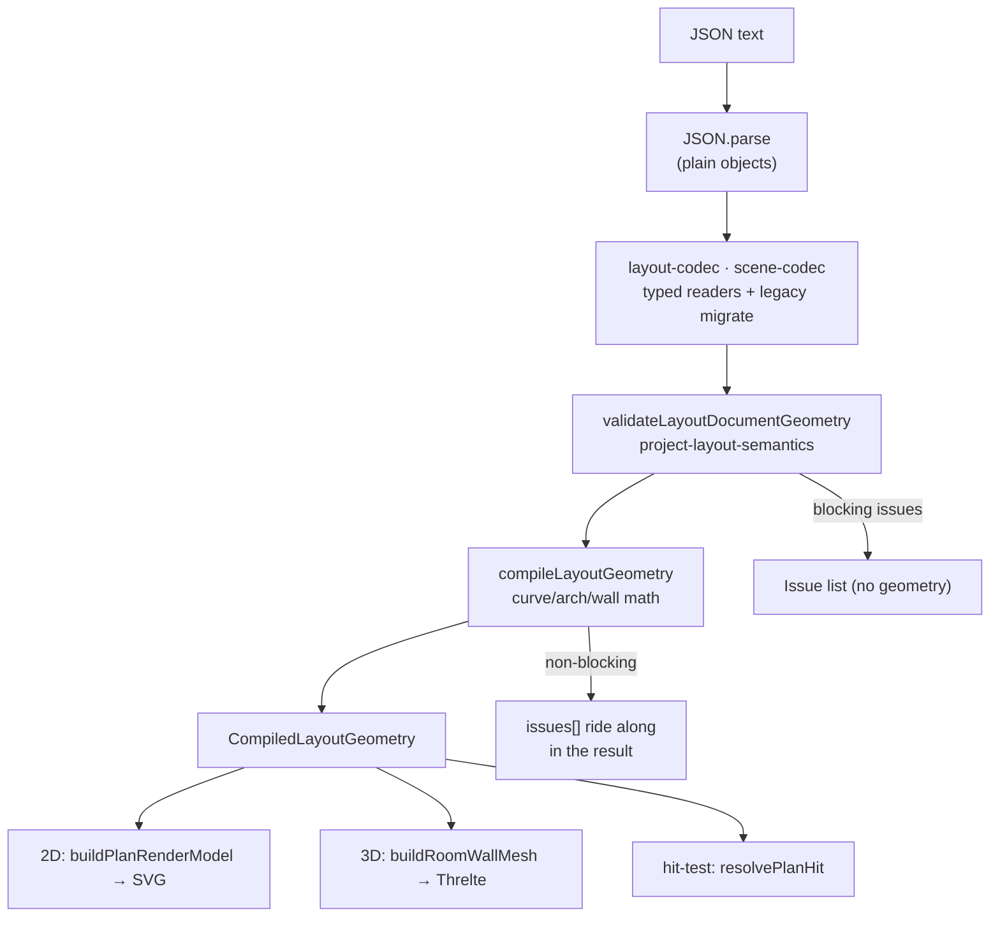
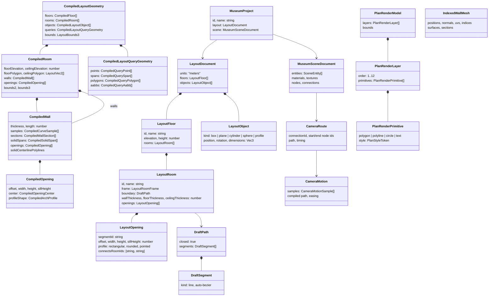

# Architecture Diagrams

Companion to [`overall-flow.md`](./overall-flow.md). Built from source (`apps/museum/src/lib`)
on 2026-08-14. All diagrams are mermaid, matching the existing docs.

## Mental model: in one breath

Authored JSON documents validate into one project; a pure derivation step turns the
layout into renderer-neutral geometry; three consumers (2D plan, 3D walls, hit-testing)
read that geometry. The scene document feeds a separate camera-tour track. The source
is typed JSON.

```ts
// One shared pipeline, three consumers, one camera track
const project = parseMuseumProjectJson(json);                     // one project: layout + scene
const { geometry, issues } = compileLayoutGeometry(project.layout);
const planModel = buildPlanRenderModel(geometry);                 // 2D plan (SVG)
const wallMesh  = buildRoomWallMesh(geometry.rooms[0]);           // 3D walls (pure data)
const bufferGeo = toWallBufferGeometry(wallMesh, wallMaterialFactory); // Three.js BufferGeometry
const hit       = resolvePlanHit(geometry.queries, point, tolerance);  // selection
```

## 0. Documents: one shape, no versioning

The serialized documents carry no version fields and no migrations. Each document has
one canonical shape, and the codecs parse exactly that shape. Documents written by older
builds (with `formatVersion` / `schemaVersion` / `version` keys) are rejected as unknown
properties rather than migrated; the frozen museum files are stored in the current shape.

| Document | Shape |
|---|---|
| Layout document | `units: 'meters'`, floors → rooms (stable frame + draft paths) → openings → objects (`layout-codec.ts`) |
| Museum project | `id`, `name`, `layout`, `scene` (`project-codec.ts`) |
| Scene document | `textures`, `materials`, `entities`, `clusters?`, `navigationNodes`, `connections` (`scene-codec/`) |
| Museumpack package | manifest: `id`, `createdAt`, `generator`, `documentTitle`, textures (`package-format.ts`) |

---

## 1. High-level architecture

**In one breath:** three editor workspaces write two documents through one store; the
shared core derives geometry that both the editor preview and the visitor render.



Notes:

- **Two apps in spirit, one codebase**: the editor (authoring) and the visitor
  (`/museum`, runtime render). They share the same derived geometry IR.
- **`CompiledLayoutGeometry` is the single source of truth for 3D shape.** The
  visitor has *no* runtime geometry derivation; geometry is derived once from the
  validated project and consumed directly.
- The scene editor doesn't feed the visitor directly: the link is the serialized
  scene document (`museum-scene.json`), hence the dashed authored-data edge.
- Editor is client-side only; persistence is JSON/package export, no server writes.

---

## 2. End-to-end flow: Json → derive → 2D / 3D

**In one breath:** two authored documents validate into one project; the layout is
derived into geometry consumed by plan, 3D, and hit-testing; the scene projects into
the camera tour.



Consumers of the same `CompiledLayoutGeometry`:

| Consumer | Where | Notes |
|---|---|---|
| 2D plan (editor) | `buildPlanRenderModel` → `LayoutPlanViewport` / `PlanSvg` | renderer-neutral primitives + SVG adapter |
| 3D preview (editor) | `buildRoomWallMesh` → `toWallBufferGeometry` → `LayoutPreviewScene.svelte` | same builder + adapter, editor material factory |
| 3D visitor | `buildRoomWallMesh` → `toWallBufferGeometry` → `LayoutMuseumShell.svelte` | same builder + adapter, `wall-material-factory.ts` |
| Hit testing / selection | `resolvePlanHit` over `geometry.queries` | compiled query records, no re-derive |

---

## 3. Pipeline stages: what actually happens

The source is typed JSON; the stages below are literal steps.

**In one breath:** read JSON → validate structure → cross-validate refs → derive
geometry → consume. Blocking issues stop before geometry; non-blocking issues ride along.

| Stage | What happens | Files |
|---|---|---|
| **Read** | `JSON.parse` turns raw text into plain objects | (built-in) |
| **Validate structure** | Walk the object tree with typed readers (`readNumber`, `readVec3`, `readEnum`), allowed-key checks, ID pattern; one canonical shape, no versioned migrations | `layout-codec.ts`, `content/scene-codec/` (`readers.ts`, `parse-entities.ts`, `parse-document.ts`) |
| **Cross-validate** | Field-spanning checks: duplicate IDs, dangling `segmentId`/`roomId` refs, portal relations (door ↔ room pair), finite numbers, blocking-vs-warning issues | `layout-geometry-validation.ts`, `project/project-layout-semantics.ts`, `scene-codec/parse-document.ts` |
| **Derive geometry** | `compileLayoutGeometry`: curve sampling, arch profiles, wall sections, solid spans, query records, cache keys; pure + deterministic | `layout-geometry.ts`, `layout-geometry-curve.ts`, `layout-geometry-openings.ts`, `layout-geometry-objects.ts`, `layout-geometry-queries.ts` |
| **IR** | `CompiledLayoutGeometry` (renderer-neutral) + `CompiledLayoutGeometryResult { geometry, issues }` | `layout-geometry-types.ts` |
| **Consume** | 2D plan render model + SVG; 3D wall meshes + Threlte; hit-testing queries | `plan-render-model.ts`, `wall-mesh-builder.ts`, `render/wall-geometry-adapter.ts`, `editor/layout/plan-hit.ts` |
| **Camera track** | Scene graph → route → motion sampling | `museum/navigation/camera-route.ts`, `camera-motion.ts` |

```ts
// What "read → validate → derive → consume" looks like in code
const project = parseMuseumProjectJson(json);              // JSON.parse → validateMuseumProject
if (!project.success) return project.issues;               // blocking issues, no project
const { geometry, issues } = compileLayoutGeometry(project.project.layout); // non-blocking ride along
const planModel = buildPlanRenderModel(geometry);          // 2D
const wallMesh  = buildRoomWallMesh(geometry.rooms[0]);    // 3D (data)
const bufferGeo = toWallBufferGeometry(wallMesh, wallMaterialFactory); // 3D (Three.js)
```



Design invariants the diagrams lean on:

- **One geometry path**: editor preview, visitor, and hit testing all consume the
  same compiled IR; nothing re-samples or re-interprets curves (`layout-mesh-factory.ts`).
- **Derived vs authored**: only authored documents persist; the IR is rebuilt.
- **Renderer neutrality**: `plan-render-model.ts` imports no Svelte/Threlte/Three;
  adapters own transforms and styling.
- **Boundary tests enforce all of the above** (see §5).

---

## 4. Class / type diagram (core data model)

**In one breath:** typed authored documents produce typed derived geometry and render
models; plain data throughout, no class behavior.



Two notes on shape:

- `Compiled*` types are plain data (interfaces) produced by pure functions. No
  classes with behavior, no inheritance. The only class-like things in the codebase
  are validation errors (`LayoutDocumentValidationError`, `MuseumProjectValidationError`,
  `SceneDocumentValidationError`) and the Svelte 5 `$state` controllers in
  `editor/store/` and `editor/layout/layout-preview-state.svelte.ts`.
- `CompiledIdentity` (`id` + `cacheKey`) is the invariant on every compiled entity:
  collision-safe `geometryId()` ids, deterministic `cacheKey` for change detection.

---

## 5. Component map (module → responsibility)

| Module (src/lib) | Responsibility | Files to open first |
|---|---|---|
| `layout/` | Layout document model, codec, geometry derivation, plan render model | `layout-types.ts`, `layout-codec.ts`, `layout-geometry.ts`, `plan-render-model.ts` |
| `project/` | MuseumProject: combines layout + scene, cross-validates | `project-codec.ts`, `project-types.ts`, `project-layout-semantics.ts` |
| `content/` | Chopin data + scene document codec (v1→v6 migration) | `chopin-project.ts`, `scene.ts`, `scene-codec/index.ts`, `rooms.ts` (deprecated projection) |
| `render/` | Three.js wall-geometry adapter (`IndexedWallMesh` → `BufferGeometry`) | `wall-geometry-adapter.ts` |
| `museum/` | Visitor runtime: shells, rooms, materials, navigation | `layout/LayoutMuseumShell.svelte`, `navigation/camera-route.ts`, `navigation/camera-motion.ts`, `MuseumCanvas.svelte` |
| `editor/` | Editor: workspaces (layout/scene/camera), stores, export/import | `museum-editor.svelte.ts`, `layout/layout-preview-state.svelte.ts`, `store/document-store.svelte.ts`, `store/history-controller.svelte.ts` |
| `state/` | Visitor state (guided/free tour) | `museum-state.svelte.ts` |
| `types/` | Shared types (Vec3, materials, assets) | `museum.ts` |
| `bench/` | Performance harness (10/100/1,000-room fixtures) | `plan-bench.ts`, `browser-bench.ts` |
| `tests/` (mirrored tree) | Vitest suites incl. boundary/parity/golden tests | `tests/README.md`, `tests/lib/layout/` |

Key boundary/parity tests that pin the architecture:

- `layout-geometry-boundary.test.ts`: exactly one `compileLayoutGeometry` definition.
- `plan-render-boundary.test.ts`: `plan-render-model.ts` may not import the geometry
  derivation; adapters own rendering.
- `layout-geometry-parity.test.ts`: editor preview geometry == shared derivation output.
- `layout-geometry-golden.test.ts`: golden snapshots per fixture document.
- `visitor-import-boundary`: editor/layout modules absent from visitor chunks.
- `wall-mesh-shell-boundary.test.ts`: visitor shell imports the shared wall builder.

---

*Keep this file in sync when the pipeline changes: if a new consumer of
`CompiledLayoutGeometry` appears (e.g. a collision system), update §2's consumer
table; if the IR type changes, update §4; if a document format/schema version bumps,
update §0.*
