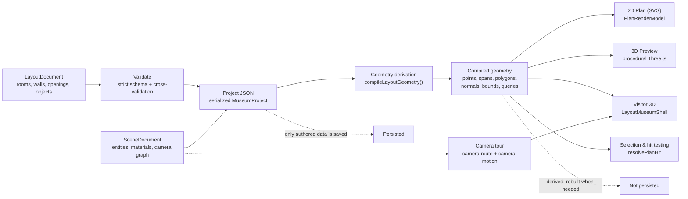

# Overall Flow

**In one breath:** author layout + scene JSON → validate into one project → derive
renderer-neutral geometry → plan, 3D, and hit-testing consume it; the scene also
projects into the camera tour. Only authored data persists.

## Notes

- Authoring produces two documents: a **layout** (rooms, walls, openings, objects) and a
  **scene** (entities, materials, camera graph), which validate into one serialized project.
- Both the editor and the visitor consume the same compiled geometry: one source of truth,
  no runtime geometry derivation.
- The plan is a pure render model over that geometry; hit testing runs over compiled query
  records (`resolvePlanHit`).
- The camera tour projects scene data through the single route/motion system
  (`camera-route.ts` + `camera-motion.ts`).
- Only authored data persists; compiled geometry is derived and rebuilt when needed.
- Documents carry no version fields; the codecs parse one canonical shape each
  (see [`architecture.md`](./architecture.md#0-documents-one-shape-no-versioning)).
