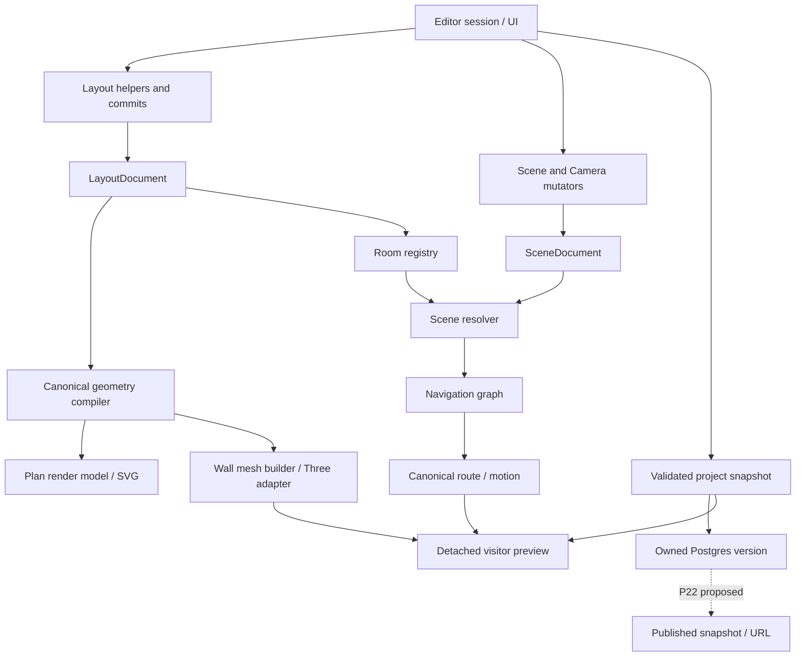
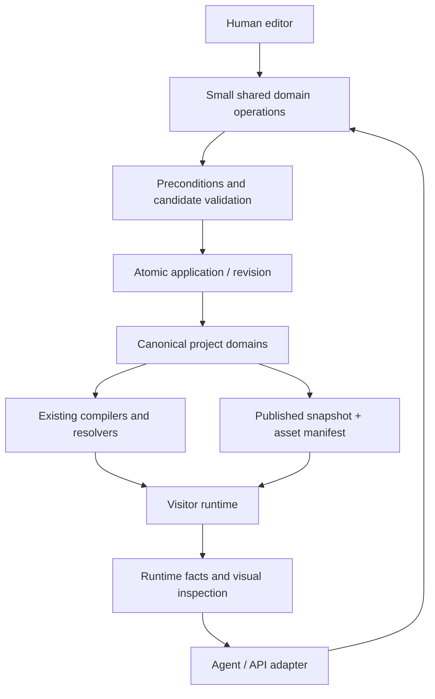

# Spatial experience product and architecture audit

2026-09-05 · Advisory report · 12–36 month horizon · No implementation or ratification

> **Owner reconciliation / status note (2026-09-06).**
> Status: advisory evidence + technical findings retained. This report's
> recommendations are not ratified scope. Owner reconciliation after review:
> - broad category remains interactive spatial experiences (not exhibitions/showrooms only)
> - exhibitions/showrooms are candidate validation wedges, not the permanent category boundary
> - P21 → P22 retained unchanged (no AI work in P22, no P21 expansion)
> - P23/P24 become staged depth families (minimum useful slices first; optional tails later; separate ownership kept)
> - narrow P25 Experience proof may follow useful P23/P24 minima before optional tails
> - bounded agent/reuse proof moves earlier, after the first complete vertical slice
> - agent-native/semantic structure is a technical strategy to validate, not a claimed moat
> - no market validation, numeric savings, or provider choice is claimed here
>
> Where the body below uses narrow category language (e.g. "initially for
> repeatable guided exhibitions and showrooms"), read it as the auditor's
> advisory wedge proposal, annotated — not as ratified product scope.
> Current direction lives in `plans/README.md` (tracker) + `north-star.md`;
> ratified decisions live in `archive/plans/2026-09-06-scope-decision-roadmap-reconciliation.md`.
> Absolute local filesystem links from the original draft were converted to
> repository-relative links; external research citations are untouched.

## A. Executive verdict

**Keep the product category, preserve the core, and shorten the route to evidence.** Build a **spatial experience runtime and authoring platform**, initially for repeatable guided exhibitions and showrooms. Humans and agents are clients; neither is the category. “Agent-native substrate” describes a technical advantage to prove, not a customer outcome or an established moat.

The current North Star is substantially right. It already contains the research's main recommendation: semantic project state, shared operations, validation, reusable runtime, and replaceable generators. Adding more AI language would accomplish little. Its weaknesses are breadth, repeated architectural prescriptions, and treating substantial Build/Stage completion as a prerequisite for testing visitor value.

**The architecture is compatible with the destination.** Layout compilation, explicit room ownership, camera route/motion, project validation, domain history, and the new detached visitor preview are real assets. Do not rewrite them. The biggest evolution is to make a small number of existing domain mutations callable without editor session orchestration, with explicit inputs, failures, and transaction ownership. This is incremental extraction, not a universal command framework.

**Finish P21, then P22. Split P23/P24 and bring a narrow Experience proof ahead of their long tails.** Existing rooms, openings, primitives, lights, and cameras already give Experience meaningful things to reference. Stairs, railings, sweep, advanced grouping, and a complete lighting catalogue are not prerequisites for a guided stop with an information card. Test the agent path after the first useful Build/Stage sets; do not hide it in an indefinite platform tier.

The strongest prospective advantage is **cheap, dependable revision and delivery across repeated projects**, including human continuation. It is not schema ownership by itself. A capable agent can generate schemas, validators, and templates too. The platform wins only when its tested combinations, delivery guarantees, and familiar editing workflow save more than its constraints and integration costs consume.

The biggest thing not to build is a general geometric/DCC toolset accompanied by a general agent framework. The more immediate danger is spending a year building the vocabulary before testing whether anyone prefers the resulting experience.

**Confidence:** high in preserving the existing core and completing publishing; medium in the exhibition/showroom wedge and proposed sequencing; low in any claim of a durable commercial moat. No customer adoption, willingness-to-pay, comparative agent benchmark, or production runtime measurements were supplied.

## B. Current-state map

Evidence labels throughout: **CURRENT FACT** = inspected source/test behavior; **CURRENT CONTRACT** = deliberate documented requirement; **RESEARCH EVIDENCE** = external source with maturity stated; **INFERENCE** = interpretation; **PROPOSED DIRECTION** = recommendation; **DEFERRED** = no implementation implied.

The attachment contains the audit request, not a second research report. I read the repository's [deep research report](./deep-research-report.md) in full and checked decision-bearing external claims. Its internal roadmap is stale: it still assigns typed DB to P23 and Experience to P24. The current [tracker](./plans/README.md:123) reserves P23 Layout, P24 Staging, P25 Experience, P26+ expansion, with typed DB conditional. Its proposed effort ranges, 25–60 calls, 3–10× savings, and star-rated moats are not measurements.

### Domains, ownership, and consumers

| Domain | Current owner / serialized truth | Mutation and history | Derivation / consumer / dependency |
|---|---|---|---|
| Project envelope | `ProjectDocument`: id, name, layout, scene | Full-project validation and import/save orchestration | `validateProject` validates both documents and cross-domain room references; no Experience or publish domain |
| Layout | `LayoutDocument`: meters, floors, rooms, frames, boundary segments, openings, objects | Pure editing helpers plus `LayoutPreviewState` commits; tagged Layout history | Compiler produces geometry, issues, bounds, query primitives; Plan and 3D consume it; Scene depends on room registry |
| Scene | `SceneDocument`: textures, materials, entities, optional clusters, camera nodes/connections | Document store + mutators + Scene transaction controller | Resolver derives runtime Scene and world camera poses; entity rendering applies room groups |
| Assets | Built-in model catalogue; Scene texture references; API project image metadata/bytes | Register/upload/read via API; local texture conversion and packaging through editor | Cloud registry accepts PNG/WebP/JPEG; catalogue model `assetId` remains a separate current representation, not a universal model ingest contract |
| Camera | Nodes, topology, interior path anchors, directional framing/timing stored in Scene | Navigation graph/path/view mutators, Scene history | `camera-route` resolves paths; `camera-motion` evaluates; editor preview and visitor director consume same core |
| Sequence | Authored next/previous links on nodes | Guided-tour mutators validate order/topology | Route walkers derive ordered traversal; no independent multi-tour document/list today |
| Selection | Editor selection reducer plus coordinated Layout selection | Workspace/navigation activation clears competing actionable picks | Session-only, mapped to tree, Plan, gizmos, Inspectors; not project truth |
| History | Editor controller: chronological tagged Scene/Layout entries, limit 100 | Begin/commit/cancel; no-op suppression; Scene commit resolves before accepting | One domain per entry; mutual exclusion prevents simultaneous Scene/Layout transaction; not a collaboration operation log |
| Shell | `EditorApp` owns live authoring/persistence/preview session; route host preserves it | Commands coordinate domain and session changes | `Scene|Camera × Plan|3D`; project surfaces wrap this; preview takeover preserves session |
| Persistence | API Postgres project versions + editor snapshot assembly | Save takes owner and full validated document; transaction locks project row and appends version | Load reads latest and revalidates; no expected-base-version precondition in inspected Save signature |
| Preview | Detached runtime Scene, compiled geometry, room registry, graph, retained texture bytes | Entry blockers, snapshot composition, disposal; no save/auth required | Generic visitor subtree with explicit graph; loader installation still performed by editor host |
| Publish | No publish endpoint in inspected API | None | P22 direction, not delivered public project runtime |
| Backend/auth/storage | Fastify; Google OIDC; app-owned session/authorization; Postgres metadata; R2 bytes through API | Parameterized SQL and ownership checks; bounded image upload | Editor receives metadata/content, not R2 credentials; runtime publishing needs its own public snapshot/asset resolution |

Primary code evidence: [Project types](../packages/project-model/src/project-types.ts), [project codec](../packages/project-model/src/project-codec.ts), [Layout types](../packages/layout-core/src/layout-types.ts), [Scene types/resolver](../packages/project-model/src/scene.ts:243), [asset registry](../apps/api/src/asset-persistence.ts:8), [catalogue](../apps/editor/src/lib/content/assets.ts), [Save](../apps/api/src/project-persistence.ts:53), [API routes](../apps/api/src/app.ts:294), [auth](../apps/api/src/auth.ts), [R2 adapter](../apps/api/src/object-store.ts).

The npm workspace split already contains `camera-core`, `layout-core`, and `project-model`, plus editor, museum, and API apps. Camera core uses Three math; portable data does not thereby become renderer objects. “Renderer-independent truth” is not the claim that every evaluator has zero renderer-library dependencies. The museum app is frozen, not the generic publish destination. [Workspace scripts](../package.json), [camera motion](../packages/camera-core/src/camera-motion.ts:2007).

### Consequential implementation findings

1. **Ownership is sound; live assembly is still editor-centric.** Layout preview stores an entire Project while Scene has its own live document store. The preview coordinator deliberately reads live Scene rather than the Layout state's Scene copy. This is a known stale-copy hazard, not proof of current data corruption. Prefer one explicit project snapshot composition boundary now; narrow Layout state to its actual authority when that code is next touched. [Layout state](../apps/editor/src/lib/editor/layout/layout-preview-state.svelte.ts:54), [preview coordinator](../apps/editor/src/lib/editor/preview/preview-coordinator.ts).
2. **Useful operations exist already.** `transformLayoutRoomUnit` validates inputs, clones, transforms, checks structure/geometry, and returns a result. `runLayoutMutation` wraps a mutation in existing history. Camera mutators expose domain behavior but also depend on selection, preview, session expansion, status, and pending UI commands through hosts. Reuse the former pattern and extract the latter's domain portions selectively. [Room transform](../apps/editor/src/lib/editor/layout/layout-room-transform.ts:21), [mutation runner](../apps/editor/src/lib/editor/layout/layout-mutation-runner.ts), [camera mutator](../apps/editor/src/lib/editor/store/navigation-graph-mutator.svelte.ts).
3. **One history stack does not mean atomic project operations.** Entries are a Scene/Layout union. A template that adds a room, objects, cameras, and content needs a deliberately composed transaction or a whole-project candidate applied atomically. It must not pretend several commits are one. [History](../apps/editor/src/lib/editor/store/history-controller.svelte.ts:49).
4. **Preview isolation is a useful start, not a complete runtime package.** The visitor surface takes explicit data; `EditorApp` installs the detached texture loader through a module-level cache hook. P22 must bootstrap the equivalent resolution in a cold visitor, without relying on editor setup. Runtime defaults also include fixed fog, ambient, and directional light. Separate author lighting from preview aids before claiming authored staging parity. [Preview surface](../apps/editor/src/lib/visitor/VisitorPreviewSurface.svelte:89), [loader installation](../apps/editor/src/lib/editor/app/EditorApp.svelte:1607), [texture cache](../apps/editor/src/lib/museum/materials/texture-cache.ts:43).
5. **Sequence is conceptually separate from topology but physically stored on nodes.** A node has one next/previous pair. Multiple tours sharing nodes, repeated visits, and per-tour timing cannot all fit that representation without ambiguity. Do not migrate today; migrate at the first such requirement. [Scene navigation fields](../packages/project-model/src/scene.ts:49), [flow route](../packages/camera-core/src/camera-route.ts:555), [visitor traversal](../apps/editor/src/lib/visitor/visitor-runtime-state.svelte.ts).
6. **Local coordinates are heterogeneous by design today.** Scene entities/camera nodes use room-local coordinates; Layout boundary points and objects are transformed directly when a room moves, together with its frame. Do not describe all Layout fields as room-local or rewrite them for symmetry. [Room transform implementation](../apps/editor/src/lib/editor/layout/layout-room-transform.ts).
7. **Versioned saves are not conflict detection.** Row locking serializes Save transactions, but no expected revision means an agent or second tab can save a stale full document as a newer version. Add revision preconditions before simultaneous writers are supported. This does not require CRDTs. [Save signature and lock](../apps/api/src/project-persistence.ts:53).

The [router](./README.md) still says persistence is export/import only; [architecture](./architecture.md:25) lags P20 completion; North Star's auth wording gives sessions to a managed provider while implemented sessions are app-owned. Treat these as documentation drift (fixed 2026-09-06 except where noted in the reconciliation record). The handoff's historical test totals were not independently rerun.

**Verification performed:** six focused existing suites, 42 tests passed: project codec, room transforms, history, detached preview, visitor state, visitor boundary. This establishes bounded contracts, not end-to-end release readiness. In particular, the retained-texture preview test permits either a string or null after registration; it does not demonstrate successful textured rendering. [Preview test](../apps/editor/tests/lib/editor/preview/preview-coordinator.test.ts:74), [history interleaving test](../apps/editor/tests/lib/editor/store/history-controller.test.ts:175). No browser, production deployment, device-performance, or customer tests were run for this advisory audit.

## C. SOTA implications

| Maturity | Evidence and limit | Product implication |
|---|---|---|
| Reliable available interfaces | Meshy documents REST generation, texturing/remeshing and MCP. This verifies an available acquisition interface, not that every generated asset meets a web budget. [Official docs](https://docs.meshy.ai/en) | Integrate supply after ingest; do not own a mesh-generation model |
| Official demonstrated workflow | The September 4 Astra Blender case produces editable architecture, furniture, lighting and cameras with render inspection and revision. It is a vendor-selected case, not a completion-rate benchmark. [Architectural visualization](https://developers.openai.com/blog/architectural-visualization-with-astra) | Manual construction difficulty and camera generation are weak moat claims |
| Official demonstrated engineering workflow | The Astra Three.js game case uses deterministic tests, browser tests, repeatable scenes and state/performance instrumentation. [Game workflow](https://developers.openai.com/blog/how-to-build-games-with-astra) | Verification is reusable value—but bespoke apps can implement it too |
| Production API, bounded representation | World Labs provides world generation and exports including splats and a collider mesh. That is not evidence of separately editable semantic walls, product parts, or interactions. [World API](https://docs.worldlabs.ai/api) | Generated worlds are a credible input and competitor; semantic recovery is not free |
| Official experimental tooling | Blender's official MCP project uses its Python API; its development announcement describes an experiment. [Blender direction](https://www.blender.org/development/projects-to-look-forward-to-in-2026/), [MCP page](https://www.blender.org/lab/mcp-server/) | Blender already offers an extensive programmable substrate; “we have tools” is insufficient differentiation |
| Research with implementation | SceneAssistant reports atomic operations and rendered feedback; SAGE provides scene generation and simulation tooling/data. Their tasks and evaluations differ from spatial-web publishing. [SceneAssistant](https://arxiv.org/abs/2603.12238), [SAGE code](https://github.com/NVlabs/sage) | Reuse structured facts and iterative inspection; do not import a robotics critic stack wholesale |
| Recent research | WorldClaw's released project is evidence of active structured-world work, not proof of turnkey customer delivery. [Official repository](https://github.com/Tencent-Hunyuan/Hunyuan3D-WorldClaw) | Watch semantic editability and runtime portability, not scene size alone |
| Emerging transport | WebMCP is documented as early preview. [Chrome announcement](https://developer.chrome.com/blog/webmcp-epp) | Keep operation contracts independent of transport; no permanent WebMCP dependency in project truth |
| Demo/community evidence | Research report's X/YouTube examples, community Blender integrations, and Three.js tool counts | Useful discovery; no reliability ranking or scheduling decision based on those counts |

**Possible but not established as dependable here:** arbitrary briefs turning into complete, performant, accessible published experiences without expert intervention; consistent physical correctness; stable semantically editable world generation; unattended recovery across arbitrary providers. I did not reproduce the research report's NaLA, Scenethesis, SceneOrchestra, VibeWorlding or Playco claims; they remain secondary research leads, not quantified support for this recommendation.

**12–36 month inference:** generation and tool use improve; models become better at creating their own infrastructure; competitors gain editability, APIs, and hosting. The platform's addressable advantage may narrow to repeated workflows with known acceptance criteria. Both creation and verification can commoditize. Invest in demonstrably reusable delivery behavior and revision workflows, not the assumption that validation remains difficult forever.

Blender's substrate value includes its existing object/data model, operators, renderer, assets, and ecosystem. This repo should borrow that reuse principle without attempting Blender's scope. A small new schema alone cannot replicate its accumulated advantage.

## D. Product thesis audit

| Current thesis | Verdict | Reason / proposed change |
|---|---|---|
| Interactive spatial experience authoring | KEEP | Appropriate category; qualify initial supported outcomes |
| Agent-native substrate is the moat | WEAKEN | Treat as measurable access/cost advantage, not guaranteed defensibility |
| Intent → structured project → operations → validation → runtime → publish | STRENGTHEN | Add revision, compatibility, and human handoff; measure total completion cost |
| Semantic architecture is valuable | KEEP | Useful for editable rooms and constraints; not justification for every CAD primitive |
| Camera generation differentiates | REMOVE as a moat claim | Direction semantics and dependable evaluation are the reusable assets |
| Shared human/agent truth | KEEP | Preserve the result contract; interaction cadence and selection needs may differ |
| Every repeated generated behavior should become a primitive | WEAKEN | Promote only repeated, stable semantics with demand; code repetition alone is not product demand |
| Experience must follow broad Build/Stage depth | REPLACE | A minimal complete visitor journey can precede the long tail of geometry and staging |
| One asset ingest boundary | STRENGTHEN | Close actual image/model/media gap; preserve provenance and immutable identity |
| Full platform serving many verticals | WEAKEN | Start with guided exhibitions/showrooms; prove adjacent reuse before expanding |
| Templates, revision benchmarks, customer outcome evidence | ADD | They test whether infrastructure reuse produces actual advantage |

**Category choice:** spatial experience runtime and authoring platform. Initial users are exhibition/showroom creators and small studios that repeatedly deliver browser-based guided spatial content, with agents assisting or performing production. Compared with raw code, offer reusable behavior and manual continuation; compared with Blender, offer web-native visitor delivery and bounded interaction semantics; compared with generators, offer deterministic revision and execution. These are proposed advantages, not current market facts.

Stop at curated spatial-web presentation and bounded behaviors. Rendering research, mesh authoring, construction compliance, general gameplay, and arbitrary web applications remain external. Permit external app code around the runtime later; do not require every custom behavior to become project schema.

The strongest alternative is a runtime/embedding product for developers. It becomes preferable if users consistently generate external apps but retain this runtime. A pure agent backend is another alternative, but current human editor investment and absent API demand make it a premature primary position.

## E. Architecture contract audit

| Contract | Why exists | Future pressure | Verdict / confidence | Migration consequence |
|---|---|---|---|---|
| Layout ≠ Scene | Different semantic ownership and geometry responsibilities | Templates, procedural structures, atomic room-and-content edits | REAFFIRM ownership; high | Preserve documents; compose transactions across them rather than merge |
| Room-local Scene/camera transforms | Moving a room preserves content relationships | Outdoors, imported worlds, cross-room subjects | EVOLVE scope only when needed; medium | Keep existing local frames; later explicit world/region placement, never infer ownership |
| One canonical geometry compiler | Plan/3D topology parity and deterministic queries | Rich curves, stairs, cost of whole-document recompilation | REAFFIRM; high | Add primitive compilers/incremental caching internally if measured; no second authority |
| One graph / route / motion | Prevent divergent movement and preview behavior | Cuts, free movement, branches, multiple tours | EVOLVE semantics, retain evaluator authority; high | Cuts are explicit transition presentation, not fake travel; free navigation policy feeds canonical runtime |
| Topology ≠ Sequence | Connectivity differs from editorial order | Node reuse in multiple tours, repeated occurrences | EVOLVE representation on trigger; high | Migrate links into a first-class ordered traversal in the existing Camera domain; codec + timeline + tests affected |
| One logical history result | Undo matches intent and gesture | Multi-domain agent batches and templates | EVOLVE transaction extent; high | One candidate validation/application boundary, existing stack integration; no generic event-sourcing rewrite |
| Session selection isolation | Prevent conflicting tools and transient persistence | Concurrent agent/human work | REAFFIRM; high | Agent addresses explicit IDs; it does not need to change human selection to mutate |
| Visitor/editor isolation | Payload, attack surface, lifecycle independence | Embedded runtime and authoring preview | REAFFIRM; high | P22 runtime boot cannot import editor loader/store infrastructure |
| Portable/versioned truth | Ownership and migration independence | Runtime changes, async providers, hosted versions | EVOLVE compatibility envelope; high | Distinguish schema version, save revision, publish revision, runtime/asset revisions |
| Project assets shared across modes | Avoid duplicate ingest and references | More asset types and provider exports | EVOLVE implementation; high | Extend image registry and model resolution, do not create provider-specific registries |
| Experience references Spatial | Avoid duplicated paths/objects | Convenient contextual editing | REAFFIRM data ownership; EVOLVE UI restriction later; medium | Any future contextual edit calls same Camera operation; no copied values |
| Fixed Scene/Camera × Plan/3D forever | Stable present workflow | Task-centric kits, agent-assisted editing | NEEDS EVIDENCE as permanent UX rule; medium | Keep P21 unchanged; later usability evidence may change navigation without changing domains |
| Frozen museum lane | Protect deployed relic while product grows | Maintenance burden of duplicate app code | REAFFIRM current boundary; DEPRECATE as future product foundation; high | No migration or forced unification; remove relic only on explicit owner decision |
| Provider independence | Durable projects survive supplier changes | Provider-native semantics/splats | REAFFIRM; high | Add typed capability/version adapters; reject unsupported conversion claims |

For each evolution, preserving the core is cheaper than replacement. Room frames can gain an explicit additional coordinate space without rewriting existing rooms. Tour occurrences can reference the existing topology and motion data. Project transactions can contain separate documents. A visitor-safe bootstrap can reuse P21's renderer leaves. These preserve the main contracts while obtaining the strategic benefit.

The exception is permanently insisting that all experiences fit rooms and one linked sequence. If imported-world or nonarchitectural use becomes the chosen wedge, that constraint may become a material barrier. Today it is a bounded product scope, not a reason for an immediate world-graph redesign.

## F. North Star audit, section by section

Read against [the complete North Star](./north-star.md).

| Section | Verdict | Exact amendment intent |
|---|---|---|
| Product vision | STRENGTHEN | Name initial repeatable outcomes; replace assured advantage with comparative success test |
| Project shell and modes | KEEP | State current creative lenses, not mandatory workflow stages |
| Core authoring model | WEAKEN permanence | Preserve current UI; remove claim that future usability cannot change axes |
| Build | WEAKEN scope | Precision, room/opening reuse first; sweep/revolve/roof helpers demand-gated |
| Stage | STRENGTHEN | Prioritize asset delivery closure, placement, material/lighting consistency before provider count |
| Direct | KEEP + STRENGTHEN | Editable evaluated direction over automatic camera generation; tours/cuts gated by real journeys |
| Experience mode | REPLACE sequencing paragraph | Minimum authored environment suffices; no dependency on complete Layout/Staging catalogues |
| Same world, different lens | KEEP | One canonical world/runtime |
| Spatial camera vs Experience authority | EVOLVE wording | Preserve sole data/mutation authority; contextual UI restriction is current policy, not eternal ownership law |
| Interaction and behavior | KEEP, bounded | Event → Target → Action is an authoring grammar, not yet a complete runtime semantics |
| Web experience layer | WEAKEN | Cards, links, media, navigation first; forms/page building need a separate demand case |
| Preview and publish | STRENGTHEN | Cold runtime parity, immutable release closure and explicit compatibility policy |
| Developer/export | KEEP, DEFER broad SDK | Narrow embedding only when a second consumer exists |
| Accounts/backend/collaboration | CORRECT + DEFER | Identity external, sessions currently app-owned; distinguish versioning from collaboration |
| AI and agent surface | KEEP | Small testable operation slice before prompt planner |
| Shared authoring operations | STRENGTHEN | Explicit IDs/units/preconditions/errors; reuse inspected helpers; cross-domain atomicity on need |
| Project truth | KEEP | Preserve ownership; distinguish actual envelope from future domains and version metadata |
| Sacred contracts | REWRITE framing | “Durable contracts and review triggers”; separate ownership invariants from revisable UI conventions |
| Technology gates | KEEP | No renderer/WASM/backend rewrite without measured pressure |
| Permanent non-goals | KEEP | Add general scene-generation infrastructure and generic agent orchestration as things not to own |
| Deferred scope | CUT redundancy | Remove already-delivered account persistence/dashboard/backend from future-only enumeration; demand-gate district/BIM-adjacent growth |
| Agent-readiness acceptance | STRENGTHEN | Revision locality, stale-write rejection, failure rollback, same delta through UI/headless path |
| Strategic success test | REPLACE metric sprawl | Five outcome metrics in O; compare against a strong reusable starter baseline |
| Final hierarchy | KEEP as conceptual | No requirement to implement every box or serialize all UI hierarchy |

**Product loop: EVOLVE.** Build, Stage, and Direct are understandable creative verbs, not a waterfall or six mandatory modes. Use `Brief → Compose ↔ Direct ↔ Shape visitor journey → Preview/validate → Publish → Revise`. Layout may be imported or templated; a creator may start with a story or product and never draw a wall. Humans can work visually; agents can batch operations. Both converge on the same project.

## G. Roadmap audit

| Tier | Current purpose | Verdict | Strategic leverage / dependencies | SOTA effect | Risk / success evidence |
|---|---|---|---|---|---|
| P21 | Shell, project flows, polish | KEEP | Closes active reconciliation; existing acceptance gates | Mostly neutral; usable human handoff remains necessary | Endless chrome work; finish current gate, no new depth |
| P22 | Basic Publish/runtime | KEEP, clarify acceptance | First durable execution target; depends on existing persistence/assets/preview | Reuse value rises, but hosting alone commoditizes | Scope inflation; prove cold public loads, frozen asset closure, preview parity |
| P23 | Layout Depth | SPLIT | Minimum precision/reuse set; optional architectural catalogue follows demand | Manual modeling advantage falls; semantic repeatability retains value | CAD drift; users create/revise useful rooms without mesh/code work |
| P24 | Staging Depth | SPLIT / interleave minima | Placement, materials and authored lights; asset-delivery gap may gate it | Generated arrangements improve; editable revisions remain useful | DCC drift; stage two different projects with same operations |
| P25 | Experience Foundation | REORDER ahead of depth tails | Destination/card/action proof needs existing cameras/assets, not stairs | More valuable as raw worlds improve | General app builder; ship one coherent visitor journey first |
| P26+ | Platform expansion | SPLIT; advance agent proof and simple reuse | Agent probe needs stable small operations + runtime; provider integration needs ingest | Directly tests substrate thesis | Huge API/template/collaboration programme before demand |
| Typed DB | Conditional infrastructure | KEEP conditional | Parameterized SQL is sufficient until concrete pressure | Stronger agents do not remove need for correct SQL | Unrelated migration; adopt for measured query/type pain |
| P13 / branch rejoin | Unscheduled camera additions | DEFER | Trigger from observed visitor journey needs | No independent moat | Polishing hypothetical tours before real visitors |

P23 and P24 should remain separately owned engineering scopes, but that does not force “all Layout before any Staging.” Their minimum slices can be sequenced by the chosen demonstration's blockers. Experience can disappear as a large separate authoring mode if users prefer generated external UI; its runtime semantics need not disappear with it.

## H. Recommended roadmap

1. **NOW — finish P21.5 and the existing final gate.** No severe reason found to interrupt. Record this audit as advice only.
2. **NEXT — P22 Basic Publish.** Owned snapshot, closed asset resolution, cold visitor boot, preview equivalence for supported content, public URL, bounded failure reporting. Keep Experience authoring and agent transport out. Include minimum visitor controls that make the supported published journey usable on touch and keyboard; that is runtime delivery, not an Experience editor.
3. **THEN — minimum Build and Stage sets.** Precision/opening reuse; durable supported assets; explicit placement; material/light edits. First identify whether GLB import/delivery is required for the chosen pilot. If it is, make that a bounded dependency rather than pretending image registry completion covers it.
4. **THEN — narrow Experience foundation before catalogue tails.** One destination binding, one information-card primitive, one semantic reach/click trigger with show/hide/link actions, accessible navigation and reduced-motion behavior. Decide persistence ownership in that plan; no schema is authored by this audit.
5. **THEN — bounded agent/reuse proof.** One ordinary project template; a small operation/inspection surface; edit → validate → preview → publish using the same result as the human UI. Reuse an external capable agent. No built-in planner required.
6. **LATER — follow evidence.** Richer Layout/Staging, multiple tours/cuts/cues, one provider adapter, reusable kits, or embeds according to repeated blockers and adoption.
7. **DEFER — multiuser editing, marketplace, general runtime SDK, automated physical critics, world reconstruction, universal constraints, general prompt planner.** Revisit each only when a supported outcome demands it.
8. **AVOID — DCC/BIM/game-engine scope and wholesale core rewrites.**

Indicative horizon, not an effort estimate: first year prove reliable delivery and repeat usage; second year expand the winning workflow and integration surface; third year consider ecosystem/collaboration only if reusable projects are actually being produced. Calendar time alone is not an expansion gate.

Keep reserved P numbers as labels for their current ownership areas. Change dependencies and split future plans on registration; do not rename existing files. P25 foundation may follow P23/P24 minima while their remaining work is separately registered later. Section Q gives exact direction-only wording.

## I. P23/P24 capability ranking

Relative estimates, not measured engineering costs. H/M/L indicate human value, agent value, reuse, semantic leverage, cost, and risk. Risk includes compiler/interaction complexity and drift into DCC/CAD. Rank applies to the initial exhibition/showroom wedge.

| Rank / Layout capability | Human | Agent | Reuse | Semantics | Cost | Risk | Recommendation |
|---|---|---|---|---|---|---|---|
| 1 Dimensions/numeric placement; targeted snapping/alignment | H | H | H | H | M | L–M | Minimum; explicit constraints and units, not a global solver |
| 2 Existing doors/windows/openings: sizing, placement, repeat | H | H | H | H | M | M | Extend existing variants; do not treat these as absent today |
| 3 Room/structure duplicate and repeat | H | H | H | H | M | M | Minimum reuse; IDs and dependent references must remap |
| 4 Platforms/columns/simple fixtures | M | H | H | M | L–M | L–M | Presets over existing primitives where sufficient |
| 5 Mirror and bounded offset | M | H | H | M | M | M | Add for demonstrated precision workflows; opening/reference parity matters |
| 6 Stairs and levels | M | M | M | H | H | H | Demand-gate; navigation/support/clearance implications exceed mesh creation |
| 7 Railings | M | M | M | M | M–H | M–H | Bounded preset/import first; add semantic runs if repetition warrants |
| 8 Curved-wall refinement | M | M | M | H | M–H | H | Existing auto-bezier path first; don't introduce second sampling path |
| 9 Parametric components | H | H | H | H | H | H | Prove two useful fixed families before a generic component system |
| 10 Profile/extrude | M | M | M | M | M–H | H | Existing profile primitive first; no broad modeling workbench |
| 11 Sweep/revolve/roof helpers | L–M | M | M | M | H | H | Defer; imports handle initial outcomes |
| 12 General constraints, BIM rules, arbitrary CAD kernel | L for wedge | M | uncertain | H | Very high | Very high | Avoid without category change |

**Minimum Build:** edit room dimensions/frame; place/resize existing openings; numeric transforms/alignment; duplicate a supported room/structure; a platform/column preset where existing primitives suffice. Do not require every listed object kind before Experience. Runtime relevance is highest for navigable boundaries/openings and usable support surfaces; decorative construction can remain imported Scene assets.

| Rank / Staging capability | Human | Agent | Reuse | Semantics | Cost | Risk | Recommendation |
|---|---|---|---|---|---|---|---|
| 1 Durable asset placement and replacement | H | H | H | H | M–H | M | Minimum; explicit pivot/size/room/asset identity; verify supported model delivery |
| 2 Duplicate + multi-select transforms | H | H | H | H | M | M | Minimum; one gesture/history result |
| 3 Floor/wall snapping and support-aware placement | H | H | H | H | M | M | Minimum targeted relations, approximate checks clearly labeled |
| 4 Align/distribute/spacing | H | H | H | H | M | M | Bounded world/room axes and chosen bounds policy |
| 5 Material edits and reusable presets | H | H | H | H | M | M | Existing Scene material ownership; show actual asset/material support |
| 6 Point/spot/directional light authoring | H | H | H | H | M | M | Types already exist; expose/edit consistently, preserve units/conventions |
| 7 Ghost placement and guides | H | L | M | L | M | L | Valuable human feedback; no need to serialize ghosts |
| 8 Lighting rig + environment preset | H | H | H | H | M | M | Minimum repeatable visual setup after preview/runtime parity |
| 9 Grouped movement | M | H | H | M | M–H | M–H | Inspect clusters first; do not mistake hierarchy metadata for transform hierarchy |
| 10 General procedural shading/light graphs | L–M | M | uncertain | M | H | H | External DCC/render tooling |

**Minimum Stage:** durable place/replace, duplicate, explicit transform, floor/wall alignment, material edit, useful point/spot/directional controls and one lighting rig. Human polish is required for selection, Inspector legibility, Plan readability, transforms, and asset placement. Those are quality requirements, not separate moats. Rank heavy investment: delivery correctness → stable semantics/revision → staging/direction usability → reusable recipes → chrome refinement. Theme perfection and duplicated generic transforms rank last.

Authored light state: kind, pose/orientation, color/intensity, supported range/cone/penumbra, shadow intent. Temperature should be either a canonical color representation or an authoring convenience converted to color—not independently conflicting truth. An explicit target binding becomes durable only if retargeting with a subject is promised; otherwise resolve target intent into ordinary orientation. Ambient/environment belongs to Scene staging when introduced. Shadow maps, allocations, renderer light objects, quality-dependent resolution, and computed bounds remain derived. Add environment/intensity semantics before an HDRI browser or a physical lighting simulator.

## J. Agent-ready architecture

**CURRENT FACT:** pure codecs, compiler, room transforms, graph validators and motion evaluation exist. UI-independent end-to-end authoring does not. An MCP wrapper shipped tomorrow could expose some useful functions, but broad coverage would mostly wrap editor session choreography. That is not yet a good public domain language.

**PROPOSED DIRECTION:**

The first surface should inspect a project, identify rooms/entities/cameras/assets with bounded summaries, apply explicit transforms or opening/light/timing edits, return validation issues, preview, checkpoint, and publish. Add content bindings only after their real semantic implementation. Names are illustrative, not existing API claims.

Inputs need stable IDs, documented units/coordinate space, explicit desired values, and base revision where concurrent writes are possible. Results need changed IDs, structured failure codes/paths, and committed revision. Inject ID generation/time at the boundary when needed for deterministic tests. “Set duration to 5” is preferable to “click slower” and easier to retry safely. Async acquisition needs an operation/job identity and later validated acceptance; it is not a synchronous Scene mutation.

Do not expose begin/commit as a long-lived remote lock by default. Build a candidate, validate it, atomically apply it, return a diff. Agent batches can use a checkpoint/transaction while human gestures continue to use existing history. Selection and camera observer pose remain per-client session state. A failed operation must not half-apply, create phantom history, or change selection as an accidental prerequisite.

Agents may generate external app code, assets, or offline conversion scripts. Canonical import can accept validated complete documents; “no arbitrary JSON mutation” should not forbid a versioned, validated project import. Hosted arbitrary code inside project truth is a different risk and capability contract and remains deferred.

Choose transport only after the first client's need: in-process TypeScript for proving operations; a thin MCP adapter for an external agent if that is its easiest path; REST for hosted revision/publish boundaries; WebMCP for browser-local authoring if support is suitable. Do not simultaneously productize four transports.

### Evolution and extraction triggers

| Change | Timing | Benefit | Cost/risk | Affected domains / dependency |
|---|---|---|---|---|
| Shared snapshot assembly and cold visitor bootstrap | NOW in P22 planning | Preview/publish equivalence | M; resource lifetime/cache risks | Runtime, assets, API; P22 |
| Pure operation extraction per capability | NOW as new depth is implemented | Human/agent parity, clearer tests | L–M per slice; behavior drift | Layout/Scene/Camera; P23/P24 minima |
| Project transaction support | WHEN first multi-domain operation appears | Atomic templates and deletion/rebinding | M–H; rollback/selection/asset lifetimes | History + project domains; template/Experience needs |
| Expected revision and retry identity | BEFORE concurrent agent/user writers | Prevent stale overwrite/repeated side effects | M; API conflict UX | Save/operations/async assets |
| First-class tour occurrences | WHEN second tour/repeated node demanded | Unambiguous order/timing | H; codecs, route adapters, timeline | Camera; no second evaluator |
| Explicit world/region coordinate ownership | WHEN imported/outdoor briefs require it | Stops fake-room modeling | H; transforms/queries/placement | Layout/Scene/runtime |
| Runtime package | WHEN P22 has editor preview + actual public consumer | Enforce one usable runtime boundary | M; remove app aliases/resource assumptions | Existing visitor leaves, not museum relic |
| Authoring package | WHEN second non-UI client uses several extracted functions | Stable import and dependency boundary | M | Existing domain helpers; leave session/UI out |
| CRDT, generic command bus, renderer rewrite | NOT WORTH IT now | No demonstrated outcome benefit | H–very high | Cross-cutting migration and distraction |

No package split for Camera document, Experience, providers, or validators merely to match the diagram. Keep pure functions in existing packages until real dependency pressure supplies a reason.

## K. Validation and observability

1. **Deterministic validity first.** Reuse `validateProject`, Scene codec checks, compiler issues, route/Sequence checks. Return stable paths/codes and IDs; distinguish corrupt references from warnings. Publishing must check the complete referenced asset closure, not just valid JSON.
2. **Cold runtime facts next.** Snapshot/runtime version, asset readiness/failures, initial node, active route/transition, errors, load timings and a few rendering counters. Add named fixture states and wait-for-ready semantics. Inspecting an already warm editor is not a publish test.
3. **Spatial queries from existing compiled geometry.** Bounds, distance, room membership and support/clearance candidates. AABB overlap is approximate; do not label it proven mesh collision. Curves/openings must use canonical compiled geometry.
4. **Camera checks incrementally.** Route reachability first; finite sampled poses/FOV and gross clipping second; explicit subject/frustum/occlusion checks only when a shot actually names a subject. Sampling reports sample coverage, not a mathematical guarantee over a continuous path.
5. **Visual critique last.** Screenshots at reproducible states complement facts. A VLM's aesthetic judgment is advisory, not a hard proof of accessibility, collision freedom, licensing or publish safety.

P22 acceptance should cover a fresh unauthenticated visitor loading a version after editor shutdown, save-after-publish leaving that version unchanged, missing asset failure, keyboard/touch navigation, reduced motion, and a chosen mobile performance budget. Define the actual device/network before setting numbers. Do not import the research report's “zero collisions” or “95% visibility” as universal release gates.

Interaction runtime design must specify activation, repeated events, seek/replay, cancellation, action ordering and unavailable targets. `Event → Target → Action` alone omits these. Start with reach/click + show/hide/link; bound loops and do not implement arbitrary scripting/condition graphs. Accessibility requires usable DOM content/control alternatives and understandable motion policy, not merely a label on a canvas.

## L. Reuse/template strategy

Start with a full ordinary project template; it requires no generic template engine. Measure revisions on a gallery and a showroom derived from it. Next extract the repeated parts that retain stable meaning:

| Reusable unit | Priority | Canonical expansion / limit |
|---|---|---|
| Room/opening/platform preset | First | Existing Layout objects with remapped IDs; avoid persistent template inheritance |
| Material and lighting rig | First | Ordinary Scene materials/lights; explicit placement/orientation parameters |
| Staging arrangement | Next | Asset references + transforms/support conventions; project asset closure |
| Camera inspection/reveal segment | Next | Existing views/connections/framing/timing; new IDs and subject bindings checked |
| Museum stop | After Experience minimum | Destination + card + semantic trigger + existing camera reference |
| Guided tour kit | After repeated demand | Several stops and one route; editable as ordinary project state |
| Parametric kit ecosystem | Later | Only after fixed recipes reveal stable parameters and compatibility requirements |

Asset semantics priority: stable identity/hash and provenance; dimensions/units/pivot; bounds/footprint and placement surface; preview/processing state; then optimization derivatives/LOD and clips where consumed. Do not claim generated output is editable at semantic room/object granularity unless conversion actually establishes those entities and references.

Templates should copy/instantiate normal state with versioned recipe provenance where useful. Reject missing bindings and remap references atomically. Avoid opaque blobs, hidden linked-template updates, and live template inheritance in the first version. Reuse can save calls but can also cause generic-looking work and expensive overrides; measure both.

## M. OWN / INTEGRATE / AVOID

| OWN | INTEGRATE | AVOID |
|---|---|---|
| Project semantics and version compatibility | Mesh/texture generation | Training a general 3D/world generator |
| Bounded authoring operations and revisions | Blender/DCC-produced assets | Sculpting/topology/UV/retopology/rig authoring |
| Camera/visitor behavior semantics | Libraries/marketplaces and provenance inputs | General character animation authoring |
| Runtime, publish closure, actionable diagnostics | Asset normalization/compression tools | General shader/DCC graph editor |
| Human continuation and reusable outcome recipes | World representations when demand and runtime support justify | BIM/CAD kernel/game engine/general website builder |
| Validation of supported contracts | External agent intelligence and orchestration | Generic agent framework or proprietary planner as prerequisite |

Provider classification: asset generators **ADAPTER**; texture generators **ADAPTER**; world models **OPTIONAL** until representation/runtime need is proven; Blender file workflow **ADAPTER**, live round-trip **OPTIONAL**; curated built-in assets **CORE content**, external libraries **ADAPTER**; AI models **OPTIONAL clients**, provider-specific project truth **AVOID**.

Minimum proof is one imported/generated model plus textures, accepted through canonical ingest, manually edited, saved, cold-published and exported. A second provider is not needed to prove the first customer outcome. Add one generation adapter only when acquiring assets is the repeated bottleneck; use a known supported provider selected on measured fidelity, latency, cost and terms at that time. No current provider is declared permanently best.

## N. Counterfactual stress test

| Scenario | Uncomfortable answer | Advantage required / what changes |
|---|---|---|
| A: Excellent one-prompt Three.js app | For a one-off bespoke experience, this product may lose | Win repeat delivery/revision, human handoff, known runtime behavior; otherwise choose code |
| B: Near-perfect Blender agent | Blender wins geometry, rendering, animation, and editable DCC scenes | Own browser visitor journey, revision/publish convenience; ingest Blender output without pretending to replace it |
| C: Persistent interactive world generator | If it also provides semantic edits, UI, hosting and acceptable portability, much of the thesis is threatened | Integrate only where added visitor semantics/control help; narrow or pivot if the generator owns the whole loop better |
| D: Models 10× cheaper/better | Token savings alone becomes a weak sales argument; bespoke maintenance may also get cheaper | Human review time, latency, behavior consistency, delivery failures and ownership matter more; CAD breadth loses urgency |
| E: Reliable autonomous UI/MCP agents | Agents choose the substrate matching task breadth and friction, not this product's intent | Platform for repeated guided web experiences; Blender for DCC; Unity/Godot for games/simulation; raw code for custom UI/behavior |
| F: Almost-free bespoke code | Verification, maintenance and hosting are not automatically expensive; agents can automate those too | Show repeated real-world cost advantage after changes and failures; if none, the platform is a constraint tax |

The strongest competing baseline is not an agent rebuilding a camera loader every time. It is an agent reusing a mature Three.js starter, its own validated components, a DCC pipeline, and existing deployment services. Benchmark against that. The repo's thesis is credible only if integrated semantic editing and delivery still beat that baseline for a chosen class of briefs.

## O. Strategic assumptions ledger

| ID | Assumption / evidence | Confidence | Falsifier | Roadmap consequence / review trigger |
|---|---|---|---|---|
| A1 | Generic generation commoditizes; commercial APIs and demonstrated coding/DCC workflows | High direction, low pace certainty | Asset supply remains bespoke/manual for target projects | Integrate supply; review after recurring acquisition failures |
| A2 | Strong agents benefit from structured tools; SceneAssistant and engineering workflows support feedback/tool utility | Medium-high | Strong starter-code baseline is equally cheap/reliable and more flexible | Shrink agent API or shift to runtime integration; review first benchmark |
| A3 | Reusable runtime lowers repeated cost; existing route/compiler reuse is technical evidence, not market measurement | Medium | Platform adaptation exceeds saved integration/debug work | Narrow supported outcomes; review after two substantially different pilots |
| A4 | Structured camera state retains value even if generated; existing edit/evaluate pipeline and Blender example | High | Users primarily want video or unrestricted gameplay cameras | Change wedge or deprioritize tour depth; review pilot requests |
| A5 | Validation/observability improves reliability; research/official workflows use feedback | Medium-high | Diagnostics add cost without improving completion or recovery | Keep only actionable checks; review agent failures |
| A6 | Templates lower total work; plausible reuse, no repo comparison supplied | Medium | Overrides, ID repair and aesthetic convergence cost more than fresh composition | Keep ordinary project copies, stop template engine; review repeated revisions |
| A7 | Runtime/publishing worth reusing; existing web infrastructure supplies many pieces already | Medium | Generator/vendor turnkey delivery equals platform guarantees | Runtime/embed specialization or narrower niche; review P22 and external capability leaps |
| A8 | Human editability matters; current product is built for it, no customer validation supplied | Medium | Customers accept regeneration and never continue manually | Rebalance editor investment; review real handoffs |
| A9 | Exhibition/showroom wedge has demand | Low-medium | Qualified creators prefer conventional web/video or existing tools | Revisit category before broad depth; review first pilot cohort |
| A10 | Small semantic behavior grammar covers most initial work | Medium | Most briefs require custom code or unsupported stateful interactions | Runtime SDK may outrank Experience UI; review before Experience expansion |
| A11 | Room-based model fits initial projects | Medium-high | Imported outdoor/world projects dominate | Explicit coordinate-space evolution becomes strategic; review before large-world integration |

**Five metrics:** (1) elapsed time and human intervention to accepted published result; (2) total production/revision cost, including agent calls/tokens, provider cost and failed attempts; (3) correctness of a requested revision and unrelated-change count; (4) cold runtime/publish success on declared device/network tests; (5) successful human continuation and reuse in a second project. Report sample size and failures; do not optimize tool-call counts by hiding work in giant opaque tools.

Initial benchmark: three briefs—gallery, product showroom, guided educational exhibit—each with two revisions, evaluated with the same model, assets, budget and acceptance criteria against platform and strong reusable-code baseline. A proposed expansion gate is a clear material advantage, such as roughly 2× lower median total completion effort with no quality/continuation regression; calibrate the threshold with owner economics, not as a claimed result. No “30 prompts” programme is needed before the first three expose basic gaps.

Review North Star after P22 evidence, after the first comparative pilot, before Experience schema or agent API commitment, and before a major architecture migration. A model release alone starts a bounded benchmark rerun only if it plausibly changes the economics. World generation gaining editable semantics + delivery is a stronger trigger. Otherwise review quarterly; do not churn the roadmap on every demo. This report does not create a monitoring automation.

## P. Proposed North Star amendment

**Keep:** category, same project for human/agent, separate domain ownership, canonical geometry/camera evaluation, visitor isolation, upstream generators, portable export, technology gates, non-goals.

**Strengthen:** accepted revision and delivery as the outcome; cold runtime compatibility; staged agent readiness; manual continuation; repeatable recipes and evidence.

**Rewrite:** mandatory Build→Stage→Experience order, assured moat wording, rigid UI rules masquerading as permanent domain contracts, stale auth/persistence statements.

**Remove:** repeated pipeline diagrams and roadmap P-number prescriptions from the vision; aspirational inventory duplicated across sections. Remove no proven core contract. Move sequencing authority entirely to the tracker.

**Add:** initial supported outcome class, comparative evidence gate, compatibility/revision principle, strategic review triggers.

Suggested concise replacement direction:

> Museum Editor is a spatial experience runtime and authoring platform for creating, revising, and publishing browser-based guided exhibitions, showrooms, and related spatial presentations. Humans and agents operate on the same inspectable project state through shared domain behavior.
>
> The platform owns semantic spatial and visitor behavior, dependable execution, revision, validation, and delivery. Models, DCC tools, generators, and asset suppliers remain replaceable clients or inputs. Generated work must support normal manual continuation and portable export.
>
> Build, Stage, Direct, and Experience are complementary authoring lenses, not a mandatory sequence. We add depth when it enables a demonstrated outcome or materially reduces repeated work. A minimal complete visitor journey precedes broad tool catalogues.
>
> Success means a capable creator or agent completes and revises supported experiences with materially less total effort and fewer delivery failures than a strong reusable-code workflow, without sacrificing quality or editability. Schema, tools, and hosting are means to that result, not presumed moats.

## Q. Proposed roadmap amendment

Changes below are **proposed replacements in** [docs/plans/README.md](./plans/README.md), **not applied**. Keep Rules, status enum, Active rows and existing filenames unchanged. Record an owner scope decision before applying revised sequencing. Future P reservations remain direction only; implementation is registered through ordinary plan briefs and depends-on fields.

Replace the P22 direction bullet with:

> **P22 — Basic Publish + visitor runtime.** After P21 closeout, publish an owned project revision with a closed, stable asset manifest and a cold-booting visitor-safe runtime. Reuse P21 preview/core modules and prove supported preview/publish parity, public visitor loading, minimum usable touch/keyboard/motion controls, and bounded failures. No Experience authoring or agent API. Specify the supported asset set and its limitations in the brief.

Replace P23/P24/P25/P26+ direction bullets with:

> **P23 — Layout Depth, staged.** First deliver the minimum precision, opening-editing, alignment and structure-reuse capabilities needed by the chosen published pilot. Reuse existing Layout types and the canonical compiler. Broader architectural primitives and CAD operations are demand-gated follow-ups, not prerequisites for Experience.
>
> **P24 — Scene/Staging Depth, staged.** First deliver durable supported asset placement, duplicate/transform/alignment, material edits and coherent authored lighting. Resolve any required model-ingest/publish gap explicitly. Keep Scene ownership and one logical history result. Broader grouping, environment and staging catalogue follow evidence.
>
> **P25 — Experience foundation.** Begin after useful P23/P24 minimum slices, before their optional depth tails. First prove one complete visitor journey using existing destinations/cameras, contextual content and a small semantic event/action set. Decide persistence ownership in its brief; no schema is implied by this direction entry.
>
> **P26+ — Evidence-led expansion.** Prioritize a bounded agent authoring/inspection proof and ordinary reusable project templates after the minimum authored visitor journey. Schedule richer depth, direction kits, one provider adapter, embeds, collaboration or marketplaces only against measured reuse, delivery or adoption needs. No blanket platform programme or mandatory multi-provider milestone.

Replace the final constraint `P21–P24 hold no Experience schema; Experience work remains P25+` with:

> P21/P22 contain no Experience authoring or Experience schema. Experience schema remains unregistered until the P25 brief; P25 may follow the accepted minimum P23/P24 slices without waiting for their optional depth tails. No Experience implementation tickets or codecs are created by this roadmap direction alone.

Replace references in the long “Current / near-term platform work” paragraph to serial completion of all authoring depth with `P23/P24 minimum useful authoring slices → P25 narrow visitor journey → comparative agent/reuse proof → evidence-led depth and expansion`. Update Gate status's roadmap summary only after owner ratification. Keep typed DB conditional and all P19/P20 no-ORM pins. No shipped plan is renumbered; deferred tails gain numbers only when registered. Update North Star's sequencing paragraph and the P21+ design document's future Experience status text in the same eventual reconciliation so they do not contradict the tracker.

## R. Architecture-doc amendment

Only durable ownership clarifications belong in [architecture.md](./architecture.md):

1. Correct current platform status to shipped image registry/cloud save/load; distinguish image ingest from future general model/media ingest. Correct auth/session ownership consistently.
2. Clarify `LayoutDocument` and `SceneDocument` are separately owned parts of one project; a cross-domain operation must have an explicit atomic application contract. Existing tagged history is not yet that contract.
3. At P22 design/implementation, add the visitor bootstrap/asset-resolution owner and published snapshot compatibility boundary. Do not claim an SDK exists.
4. Describe current Sequence links exactly, and preserve topology/traversal separation as the invariant. Add first-class tour representation only when its migration is designed.
5. Clarify imported assets, runtime caches/derivatives and authored semantic geometry have different roles; one layout compiler does not mean all imported meshes must be reconstructed into Layout.
6. Record operation extraction only as APIs actually land. Keep proposed package names, market thesis and speculative IR out of architecture contracts.

The frozen museum remains frozen. Clean the router's export-only persistence statement and stale comments separately from strategy ratification; they are factual drift, not authority to change product scope.

## S. Decisions requiring owner judgment

| Decision | Recommendation | Alternative | Tradeoff / why owner decides |
|---|---|---|---|
| Initial customer/outcome wedge | Guided exhibitions and showrooms | Broad spatial authoring or developer runtime | Market focus and distribution, not an architectural fact |
| Depth versus earlier visitor proof | P23/P24 minima, then narrow P25 | Finish broad depth before Experience | Earlier learning versus richer authoring; changes ratified priorities |
| Agent proof timing | After minimal complete visitor journey, before broad platform expansion | Keep API late or make agent backend primary | Validates thesis sooner but spends scarce delivery capacity |
| Model ingest in first pilot | Include if uploaded/generated GLBs are essential | Curated built-ins + images for first P22 | Generality versus smaller publish scope; must be explicit in positioning |
| Commercial fallback | Prefer runtime/embed direction if customers want bespoke app UI | Continue full Experience editor | Changes target user and investment pattern |
| Long-term contextual camera editing | Allow only through same operations if usability evidence warrants | Permanent jump back to Spatial Camera | UI flexibility versus strong mode boundaries; no current change needed |

No permission request is required to deliver this report. These choices need ratification before changing the roadmap, not before completing the audit.

## T. Top 10 actions

| Rank | Action | Why | When | What not to do |
|---|---|---|---|---|
| 1 | Close P21.5 and existing acceptance gates | Protect active work and establish usable baseline | NOW | Expand polish into depth or redesign |
| 2 | Define and ship P22 cold visitor release contract | Turns state into independently consumable output | NEXT | Reuse warmed editor state as proof of publishing |
| 3 | Select one pilot outcome and supported asset set | Gives scope and asset closure a concrete target | P22 brief | Promise arbitrary model/world delivery |
| 4 | Split Layout/Staging minima from catalogue tails | Reduces time to visitor/customer learning | Before P23 registration | Generic CAD subsystem or giant staging milestone |
| 5 | Prove minimal destination + content + action journey | Tests “experience” value beyond rendering | After minima, before tails | General web builder or behavior language |
| 6 | Extract first shared operations from existing helpers | Tests cheap headless authoring without rewrite | Alongside needed capabilities | Generic Command Pattern migration |
| 7 | Expose actionable validation and cold runtime facts | Lets humans/agents identify and repair failures | P22 onward | Giant validator or VLM-only assurance |
| 8 | Run three comparative briefs with revisions | Establishes or falsifies platform advantage | First complete journey/API slice | Weak from-scratch baseline or invented savings |
| 9 | Reuse an ordinary template, then one recipe | Measures compounded reuse with little machinery | Pilot production | Marketplace or opaque inheritance engine |
| 10 | Ratify concise vision/tracker amendments and review on evidence | Keeps strategy coherent without churn | After owner choices; again at evidence gates | Rewriting durable docs with research prose |

