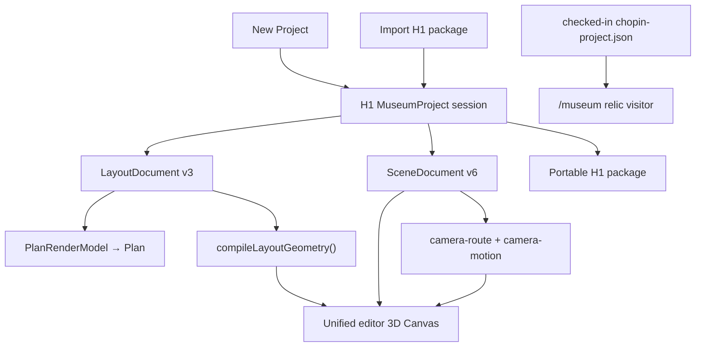

# Museum docs

**Audience:** agents + humans. **Last reviewed:** 2026-08-14

Bootstrap: [`../AGENTS.md`](../AGENTS.md). Live slice:
[`hand-off/CURRENT.md`](./hand-off/CURRENT.md). Editor code:
[`../apps/museum/src/lib/editor/README.md`](../apps/museum/src/lib/editor/README.md).

**Token rule:** read this routing hub, then only task-listed file(s). Skip archive
unless archaeology.

## Folder

```text
docs/
  README.md              ← routing hub
  north-star.md          ← product vision + priority
  architecture.md        ← ownership + editor/relic boundary
  components/            ← one contract per surface
  hand-off/CURRENT.md    ← live slice
  plans/                 ← active implementation
  archive/               ← non-authoritative history
```

## Runtime lanes



No lane crossing: H1 editor never imports/migrates Chopin, legacy workspace
state, selection, or history. `/museum` keeps checked-in visitor runtime. H1
import/export handles H1-created projects plus future explicit migrations.

## Read only what task needs

| Working on… | Read |
|-------------|------|
| Vision / priority / product-fit | [`north-star.md`](./north-star.md) |
| Ownership / editor versus relic | [`architecture.md`](./architecture.md) |
| H1 Plan → 3D editor | [`plans/2026-08-14-graphics-h1-unified-3d-editing.md`](./plans/2026-08-14-graphics-h1-unified-3d-editing.md) |
| Graphics foundation / G5 | [`plans/2026-08-13-graphics-architecture-roadmap.md`](./plans/2026-08-13-graphics-architecture-roadmap.md) |
| Shared geometry compiler | [`plans/2026-08-13-graphics-g1-shared-geometry-compiler.md`](./plans/2026-08-13-graphics-g1-shared-geometry-compiler.md) |
| Editor shell / views | [`components/shell.md`](./components/shell.md) |
| Entities / materials / library | [`components/scene-content.md`](./components/scene-content.md) |
| Gizmo / placement / transforms | [`components/placement.md`](./components/placement.md) |
| Camera/tour | [`components/camera-tour.md`](./components/camera-tour.md) |
| Schema / import/export / history | [`components/persistence.md`](./components/persistence.md) |
| GLBs / asset registry | [`components/assets.md`](./components/assets.md) |
| Current work | [`hand-off/CURRENT.md`](./hand-off/CURRENT.md) |
| Tests | [`../apps/museum/tests/README.md`](../apps/museum/tests/README.md) |
| Old layout CAD tasks | [`plans/2026-08-10-layout-cad-foundation.md`](./plans/2026-08-10-layout-cad-foundation.md) task section only |

## Update rules

- Contract change → matching `components/*.md` or `architecture.md`.
- Product priority change → `north-star.md`.
- Routing change → this file.
- Slice scratch/handoff → `CURRENT.md`.
- Archive conflict → live docs win.
