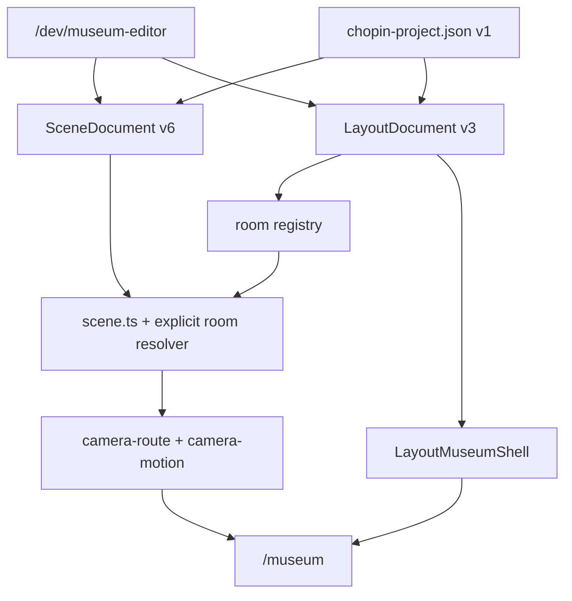

# Museum docs

**Audience:** agents + humans. **Last reviewed:** 2026-08-13

Bootstrap: [`../AGENTS.md`](../AGENTS.md). Live slice: [`hand-off/CURRENT.md`](./hand-off/CURRENT.md). Editor code: [`../apps/museum/src/lib/editor/README.md`](../apps/museum/src/lib/editor/README.md).

**Token rule:** Do **not** read this whole folder. Read **AGENTS.md** + **only the one component file** for your task (+ `hand-off/CURRENT.md` if starting a slice). Skip archive unless archaeology.

---

## Folder

```text
docs/
  README.md              ← thin hub (this file)
  north-star.md          ← vision / priority only
  architecture.md        ← ownership + Mode A/B boundary
  components/            ← one file per surface
  hand-off/CURRENT.md    ← live slice
  plans/                 ← active implementation
  archive/               ← not day-to-day authority
```

---

## How parts fit (read once if orientation needed)



`/museum` validates `chopin-project.json` once: layout v3 is the sole production architecture source and nested scene v6 owns content/tour data. `rooms.ts` is a deprecated editor/test projection and is absent from visitor imports. One motion system. Editor prod 404.

---

## Read only what you touch

| Working on… | Read |
|-------------|------|
| Vision / priorities / product-fit gate | [`north-star.md`](./north-star.md) |
| Shared geometry compiler (G1) | [`plans/2026-08-13-graphics-g1-shared-geometry-compiler.md`](./plans/2026-08-13-graphics-g1-shared-geometry-compiler.md) |
| Plan render model / procedural meshes / graphics performance and technology gates | [`plans/2026-08-13-graphics-architecture-roadmap.md`](./plans/2026-08-13-graphics-architecture-roadmap.md) |
| `rooms.ts` vs layout / promotion | [`architecture.md`](./architecture.md) |
| Editor chrome / workspaces | [`components/shell.md`](./components/shell.md) |
| Entities / materials / library | [`components/scene-content.md`](./components/scene-content.md) |
| Ghost / gizmos / scale / surfaces | [`components/placement.md`](./components/placement.md) |
| Tour graph / timeline / preview | [`components/camera-tour.md`](./components/camera-tour.md) |
| Schema / I/O / history | [`components/persistence.md`](./components/persistence.md) |
| Paris GLB / assets | [`components/assets.md`](./components/assets.md) |
| **What to build now** | [`hand-off/CURRENT.md`](./hand-off/CURRENT.md) |
| Layout CAD tasks | [`plans/2026-08-10-layout-cad-foundation.md`](./plans/2026-08-10-layout-cad-foundation.md) — task section only; focused plans [`plans/2026-08-10-layout-cad-a2-editor-preview.md`](./plans/2026-08-10-layout-cad-a2-editor-preview.md) · [`plans/2026-08-10-layout-cad-a2-2-scale-editing.md`](./plans/2026-08-10-layout-cad-a2-2-scale-editing.md) · [`plans/2026-08-11-layout-cad-a2-3-opening-authoring.md`](./plans/2026-08-11-layout-cad-a2-3-opening-authoring.md) · [`plans/2026-08-11-layout-cad-a3-bezier-arch-profiles.md`](./plans/2026-08-11-layout-cad-a3-bezier-arch-profiles.md) · [`plans/2026-08-11-layout-cad-a3-1-camera-style-bend.md`](./plans/2026-08-11-layout-cad-a3-1-camera-style-bend.md) · [`plans/2026-08-11-layout-cad-a4-objects-inspectors-io.md`](./plans/2026-08-11-layout-cad-a4-objects-inspectors-io.md) · [`plans/2026-08-12-layout-cad-a4-1-polish.md`](./plans/2026-08-12-layout-cad-a4-1-polish.md) · [`plans/2026-08-13-layout-cad-b5-runtime-cutover.md`](./plans/2026-08-13-layout-cad-b5-runtime-cutover.md) · [`plans/2026-08-10-layout-cad-a0-codec.md`](./plans/2026-08-10-layout-cad-a0-codec.md) / [`plans/2026-08-10-layout-cad-a1-line-geometry.md`](./plans/2026-08-10-layout-cad-a1-line-geometry.md) / [`plans/2026-08-10-layout-cad-c0-project-codec.md`](./plans/2026-08-10-layout-cad-c0-project-codec.md) |
| Deep camera dump | [`archive/CAMERA_AND_LAYOUT.md`](./archive/CAMERA_AND_LAYOUT.md) |
| Asset checklist dump | [`archive/ASSET_WORKFLOW.md`](./archive/ASSET_WORKFLOW.md) |

**Typical budgets**

| Task type | Files |
|-----------|-------|
| Narrow bug in one surface | `AGENTS.md` + 1 `components/*.md` |
| New slice from handoff | `AGENTS.md` + `CURRENT.md` + plan § for that task (+ `architecture.md` if layout/shell) |
| Product / priority debate | `north-star.md` only |

Update the **matching component file** when that contract changes. Update this hub only if routing/diagram changes. Slice scratch → `CURRENT.md` only.

If archive conflicts with these files, **live docs win**.
