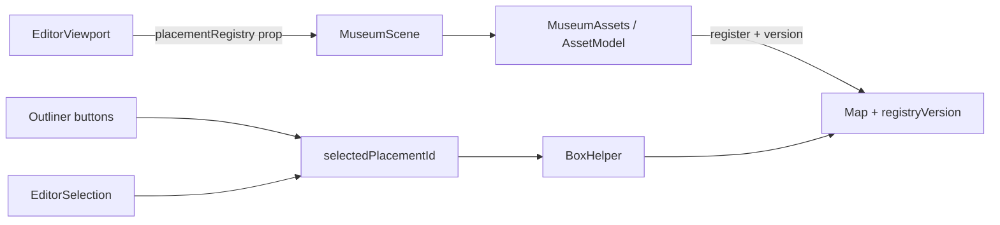

# Phase 2 Handoff — Placement Selection

## Phase Result

- **Phase goal:** select scene placements as single outer roots via an explicit raycaster, outliner, and BoxHelper — without selecting shell/locked geometry or adding transforms.
- **Completed:** document-backed `selectedPlacementId`; ephemeral Object3D registry + `registryVersion`; `userData.editorEntity` on AssetModel outer groups; prop-passed editor registry (Canvas-safe); `EditorSelection` (primary-pointer raycast, Alt-cycle, Escape); `EditorSelectionHelper` (BoxHelper dispose/raycast-off/depthTest off); selectable outliner + read-only inspector summary; pure hit/cycle helpers with unit tests.
- **Follow-up fix (3):** `effect_update_depth_exceeded` from writing `$bindable status/metrics` inside loader effects (and reactive `userData` props remounting placement roots). AssetModel now uses internal `loadStatus` + `untrack` mirrors; EditorPlacementRoot sets `userData` imperatively.
- **Follow-up fix (4):** Remaining `effect_update_depth_exceeded` was `registryVersion += 1` inside `registerPlacementRoot` called from `EditorPlacementRoot`’s `$effect` — `+=` reads+writes the same `$state`, so the effect re-subscribed and looped. Bumps go through `#bumpRegistryVersion()` under `untrack` only (single site).
- **Cleanup:** Removed unused `editor-context.ts` (prop drill only); dropped unused `get lighting()`; kept `notifyPlacementRootChanged` for Phase 3.
- **Intentionally not completed:** TransformControls, history/undo, duplicate/delete, floor placement, room/camera framing, asset library, persistence, architecture doc updates (Phases 3–8). Room framing was requested later and explicitly deferred.
- **Acceptance status:** `npm test` 45/45, `npm run check` 0/0. Manual re-check in `/dev/museum-editor`: Paris GLBs (not fallbacks), gold BoxHelper on select, outliner highlight. Production isolation unchanged from Phase 1.

## Files Changed

### Selection core

| File | Purpose and main API | Important decisions |
|---|---|---|
| [`apps/museum/src/lib/editor/editor-selection.ts`](../../apps/museum/src/lib/editor/editor-selection.ts) | Pure helpers: opacity filter, climb placement id, normal resolve, unique ids, cycle next. | Shared near-invisible threshold (`0.05`) for normal and Alt. |
| [`apps/museum/src/lib/editor/museum-editor.svelte.ts`](../../apps/museum/src/lib/editor/museum-editor.svelte.ts) | `selectedPlacementId`, `selectPlacement`/`deselect`/`cyclePlacement`, private Map + `registryVersion`. | Selection validates against `document.objects`, not the registry. Object3D map is never `$state`. |
| [`apps/museum/src/lib/editor/museum-editor.test.ts`](../../apps/museum/src/lib/editor/museum-editor.test.ts) | Selection, cycle, registryVersion, hit-filter tests. | 13 editor tests total. |

### Scene tagging

| File | Purpose and main API | Important decisions |
|---|---|---|
| [`apps/museum/src/lib/museum/assets/AssetModel.svelte`](../../apps/museum/src/lib/museum/assets/AssetModel.svelte) | GLB load + fallback only. Optional `localTransform` when parent owns pose. | No editor registry / selection effects — loader matches visitor `/museum`. |
| [`apps/museum/src/lib/museum/EditorPlacementRoot.svelte`](../../apps/museum/src/lib/museum/EditorPlacementRoot.svelte) | Outer selectable Group: pose + `userData.editorEntity` + registry register. | Keeps selection concerns out of AssetModel. |
| [`apps/museum/src/lib/museum/placement-registry.ts`](../../apps/museum/src/lib/museum/placement-registry.ts) | `EditorPlacementRegistry` type. | Shared by museum + editor without circular imports. |
| [`apps/museum/src/lib/museum/MuseumAssets.svelte`](../../apps/museum/src/lib/museum/MuseumAssets.svelte) | Visitor: bare AssetModel. Editor: EditorPlacementRoot + localTransform AssetModel. | |
| [`apps/museum/src/lib/museum/MuseumScene.svelte`](../../apps/museum/src/lib/museum/MuseumScene.svelte) | `placementRegistry` + `forceParisAssets` props. | Editor forces Paris GLB enablement. |

### Editor UI / picking

| File | Purpose and main API | Important decisions |
|---|---|---|
| [`apps/museum/src/lib/editor/EditorSelection.svelte`](../../apps/museum/src/lib/editor/EditorSelection.svelte) | Explicit Three.js Raycaster on canvas pointer events. | Primary left only; pointer capture; drag threshold; multi-touch cancel; outside-canvas ignore; Alt-cycle; Escape deselect. No per-mesh onclick. |
| [`apps/museum/src/lib/editor/EditorSelectionHelper.svelte`](../../apps/museum/src/lib/editor/EditorSelectionHelper.svelte) | One BoxHelper for selected registered root. | Depends on `selectedPlacementId` + `registryVersion`; `raycast = () => null`; `depthTest = false`; remove + dispose on teardown. |
| [`apps/museum/src/lib/editor/EditorViewport.svelte`](../../apps/museum/src/lib/editor/EditorViewport.svelte) | Builds `placementRegistry`; passes it + `forceParisAssets` into `MuseumScene`. | |
| [`apps/museum/src/lib/editor/MuseumEditorApp.svelte`](../../apps/museum/src/lib/editor/MuseumEditorApp.svelte) | Outliner buttons + inspector selection summary. | Nodes remain read-only; lighting controls kept. |

## Current Architecture

1. Outliner / raycast write `selectedPlacementId` (document-validated).
2. `EditorPlacementRoot` registers outer Group when `placementRegistry` prop is present.
3. Helper attaches when both selection and registry root exist (including late register / `notifyPlacementRootChanged`).

### Hit rules (locked)

- Skip opacity `< 0.05` for normal and Alt.
- Normal: first effective hit → placement select or deselect (locked/empty).
- Alt: unique placement ids in order; empty → no change; absent current → first; else next with wrap.

## Contracts and Invariants

- Never put Object3D refs in reactive document state / future snapshots.
- `selectPlacement` ignores unknown ids without clearing selection.
- Production isolation from Phase 1 unchanged (server 404 + virtual stub).
- No TransformControls, history, or room-camera framing yet.
- Editor Paris assets must load as GLBs (same activation seed `paris-seat`), not stay on fallbacks.

## How to Verify

1. `npm test` — Expected: 5 files / 45 tests.
2. `npm run check` — 0 errors / 0 warnings.
3. `npm run build` — exit 0; client museum-editor node stays stub-sized; no `MuseumEditorApp` / `EditorSelection` in client chunks.
4. Preview: `/dev/museum-editor` → 404; `/museum` → 200.
5. Dev `/dev/museum-editor`:
   - Paris salon shows real GLBs (sofa/piano match `/museum` orientation)
   - click piano → gold BoxHelper + inspector
   - outliner select highlights row and shows helper when root is registered
   - floor click / Escape deselects
   - Alt-cycle overlaps; OrbitControls still works

## Known Problems

- Room / selection camera framing deferred by request.
- Phase 0 pending visitor visual tour check still open.
- Store still does not re-resolve scene/state on document mutation (needed before Phase 3 transforms mutate topology).

## Next Phase Entry Point

### Exact next goal

Phase 3: `@threlte/extras` TransformControls on the outer placement root, uniform scale enforcement, inspector degrees↔radians, and snapshot history (cap 100).

### Read first, in order

1. [`docs/agent-handoffs/phase-2.md`](./phase-2.md)
2. [`apps/museum/src/lib/editor/museum-editor.svelte.ts`](../../apps/museum/src/lib/editor/museum-editor.svelte.ts)
3. [`apps/museum/src/lib/editor/EditorSelection.svelte`](../../apps/museum/src/lib/editor/EditorSelection.svelte)
4. [`apps/museum/src/lib/editor/EditorSelectionHelper.svelte`](../../apps/museum/src/lib/editor/EditorSelectionHelper.svelte)
5. [`apps/museum/src/lib/museum/assets/AssetModel.svelte`](../../apps/museum/src/lib/museum/assets/AssetModel.svelte)

### Suggested first implementation step

Attach one TransformControls instance to the registered outer root for `selectedPlacementId`, write transforms back to the session document, and introduce snapshot undo/redo before numeric inspector commits.

### Likely risks

- Feedback loops between TransformControls and Svelte props.
- Non-uniform scale sneaking past enforcement.
- Pointer ownership fights between OrbitControls, selection, and the gizmo.

## Important Decisions

- Selection is document-backed so outliner works before GLB register.
- `registryVersion` is the reactivity signal for Map mutations; do not bump it from `status` reads. Bump only via `#bumpRegistryVersion()` under `untrack` (`+=` is a read+write; never let register `$effect` subscribe to it).
- Registry is prop-drilled through MuseumScene for Canvas reliability (no context fallback).
- `notifyPlacementRootChanged` is wired for Phase 3 bounds/gizmo refresh; unused in Phase 2 UI.
- One shared transparency filter for normal and Alt picks.
- Empty Alt-cycle stack leaves selection unchanged.
- Room framing explicitly deferred after Phase 2.
