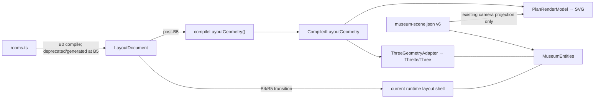

# Architecture

**Read when:** `rooms.ts`, layout CAD, promotion/cutover, ownership disputes.  
**Skip if:** only editing a scene prop, material, or tour key inside existing rooms.  
**Last reviewed:** 2026-08-13
**Hub:** [`README.md`](./README.md) · **Vision:** [`north-star.md`](./north-star.md) · **Graphics roadmap:** [`plans/2026-08-13-graphics-architecture-roadmap.md`](./plans/2026-08-13-graphics-architecture-roadmap.md)

---

## Ownership

| Concern | Today | Target |
|---------|-------|--------|
| Room poses, dims, openings, yaw | `rooms.ts` | `LayoutDocument` / `project.layout` |
| Editor layout drafts | `LayoutDocument` / `museum-layout.json` | → runtime after B4/B5 |
| Entities, nodes, paths, materials | `museum-scene.json` v6 | `project.scene` |
| Codec v1–v6 | `scene-codec.ts` | + project envelope |
| Resolve + generated endpoints | `scene.ts` | same |
| Shell cutouts | `MuseumShell` from rooms by default; B4 dual-read can use `LayoutMuseumShell` | from layout after cutover |
| Derived layout geometry | Editor `buildLayoutPreviewModel()` + runtime `buildLayoutArchitectureModel()` | one pure `compileLayoutGeometry()` |
| Plan presentation | SVG elements + overlays assembled in `LayoutPlanViewport.svelte` | `CompiledLayoutGeometry` → pure `PlanRenderModel` → SVG adapter |
| 3D architecture meshes | sampled wall-chord `BoxGeometry` in editor/runtime layout shells | `CompiledLayoutGeometry` → `ThreeGeometryAdapter` → indexed `BufferGeometry` |
| Routes / curves | `camera-route` + `camera-motion` only | unchanged |
| Tour FSM | `museum-state.svelte.ts` | unchanged |
| Editor session | `museum-editor.svelte.ts` | layout-tagged history ops (B3 implemented) |

**Camera** = 3D guided PerspectiveCamera, not webcam.

## Geometry and render boundary

B4's visitor-safe `buildLayoutArchitectureModel()` and the editor's richer
`buildLayoutPreviewModel()` are currently separate projections. The current
Chopin dual-read fixture is line-based, so B4 can prove its scoped parity without
turning B5 into a compiler rewrite. After B5, the graphics roadmap consolidates
adaptive curves, arc lengths, tangents/normals, openings/profiles, polygons,
bounds, and query records into one pure `CompiledLayoutGeometry` contract.

`LayoutDocument` remains authored semantic CAD data. Compiled geometry is derived,
cacheable, renderer-neutral, and never serialized. It may contain plain values or
backend-neutral typed arrays, but never SVG nodes/path strings, `THREE.*` objects,
WebGL/WebGPU handles, materials, cameras, or UI state.

The Plan branch owns ordered world-space render primitives. World/screen
transforms, SVG attributes, styling, and transient interaction are separate. Plan
camera/tour overlays may project `project.scene` through the existing
`camera-route.ts` / `camera-motion.ts`; that does not transfer camera ownership to
layout or create another motion path.

The Three adapter owns indexed vertex/index buffers, normals, UVs, mesh groups,
and resource disposal. Three/Threlte continues to own the scene graph, GLBs,
materials/PBR, lights, shadows, cameras, and visitor lifecycle. Mesh merging is
bounded by measured room/material batching and edit granularity; never compile the
whole museum into one mesh.

## Mode A vs B

| Mode | Meaning | Status |
|------|---------|--------|
| **A — Dressing** | Props inside fixed architecture | Supported; presets deferred |
| **B — Layout authorship** | Draw/relocate rooms in layout data | **North star**; P0 |

- Layout meshes = **previews** in editor; B4 adds an explicit dev-only visitor dual-read branch with runtime-safe shared layout modules. No editor layout UI/store imports in visitor chunks.
- A3 layout paths accept line + Bezier segments; openings use meter offsets along sampled arc length, while rounded/pointed profiles affect wall elevation only.
- Corridors = skinny **layout rooms** (or later open wall-strip).  
- Cutouts = segment-split; no real-time CSG.  
- **Do not** treat scene Wall presets as shell authorship.

## Corridor and opening decision

P0 models corridors as ordinary skinny `LayoutRoom` footprints, not a special corridor entity. A corridor may have two rectangular geometric cutouts in A1; this reuses room generation and avoids a second wall-strip system.

**Pros:** simplest MVP; same floor/wall/ceiling generation; future room containment and camera IDs; no corridor-specific renderer.  
**Cons:** duplicated/shared wall geometry remains a future authoring concern; B4 now carries explicit portal semantics and renders layout shell parity without changing navigation.

A1 openings were geometry-only. B4 layout v2 adds explicit `connectsRoomIds: [string, string]` for interior doors/portals; windows remain unpaired. `projectLayoutPortalRelations()` de-duplicates pairs for inspection only. Geometry never creates, repairs, or guesses adjacency. Default visitor architecture remains `rooms.ts`; B5 owns cutover.

## Hard don’ts

Dual nav graphs · persist `node:<id>:position` endpoints · put render-backend state in `LayoutDocument` or compiled geometry · build a second geometry compiler in a render adapter · replace Three without a measured production limitation · wire `@portfolio/scroll-travel` casually · ship editor to prod visitors (`/dev/museum-editor` → 404).
