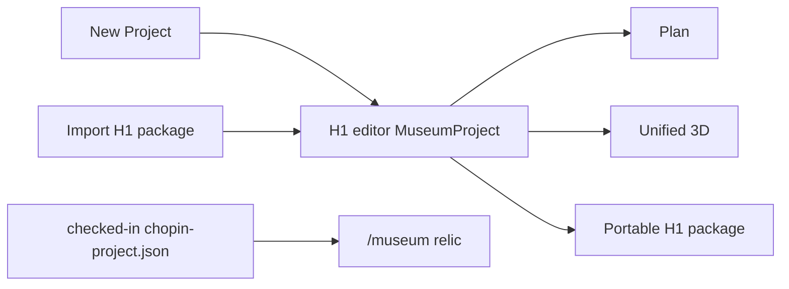

# Architecture

**Read when:** ownership, layout CAD, editor shell, import/export, `/museum`
boundary.  
**Last reviewed:** 2026-08-14  
**Hub:** [`README.md`](./README.md) · **Vision:**
[`north-star.md`](./north-star.md) · **H1:**
[`plans/2026-08-14-graphics-h1-unified-3d-editing.md`](./plans/2026-08-14-graphics-h1-unified-3d-editing.md)

## Two isolated lanes



- **H1 editor:** greenfield. Starts empty or imports complete H1-format project.
- **`/museum`:** frozen Chopin visitor relic. Keeps current checked-in project,
  runtime, route graph, controls, and production behavior.
- **`/museum/editor`:** frozen pre-H1 Scene · Camera editor relic (no Layout).
- No Chopin project/editor state/history migration into H1.
- No editor export promotion into `/museum` in H1.
- The editor ships in production builds. Shared visitor-safe geometry/render
  modules may serve both lanes; session, selection, hierarchy, gizmo, import,
  and asset-store code stay editor-only imports.

## Ownership

| Concern | Source of truth |
|---------|-----------------|
| Rooms, frames, boundaries, openings | `project.layout` / `LayoutDocument` |
| Rough parametric layout objects | `project.layout.objects` |
| Scene models, primitives, lights, materials | `project.scene` / `SceneDocument` |
| Camera nodes, connections, paths, view tracks | `project.scene` |
| Derived geometry | pure `compileLayoutGeometry()` |
| Plan presentation | `CompiledLayoutGeometry` → `PlanRenderModel` → `PlanSvg.svelte` |
| 3D wall meshes | `wall-mesh-builder` → `wall-geometry-adapter` |
| Camera route/motion | `camera-route.ts` + `camera-motion.ts` only |
| Project-local GLB bytes | portable package manifest + editor asset store |
| Selection, history, gizmo proxies, UI | editor session only |

Generated geometry, Three objects, renderer handles, selection, and history are
never serialized.

## H1 editor composition

```text
MuseumProject session
  ├─ Plan
  │    LayoutDocument → compileLayoutGeometry → PlanRenderModel → SVG
  └─ 3D Canvas
       ├─ compiled layout architecture
       ├─ scene entities/materials/assets
       ├─ camera helpers + existing route/motion projections
       ├─ unified project hierarchy + contextual inspector
       └─ one TransformControls host
            ├─ layout adapter  → layout mutation/history
            ├─ scene adapter   → scene mutation/history
            └─ camera adapter  → scene mutation/history
```

One active selection domain: `none | layout | scene | camera`. Activating one
domain detaches previous gizmo target. Underlying identity types remain separate.

Plan has no camera mutation path. Optional read-only overlays do not transfer
camera ownership.

## Project lifecycle

- New Project creates empty layout + empty scene; opens Plan.
- Session-only free PerspectiveCamera exists until first authored navigation node.
- Full-project import validates layout, scene, room refs, package manifest, GLB
  and texture references before atomic replacement.
- Import accepts H1 format plus future explicit migrations rooted at H1.
- Import rejects Chopin/legacy payloads. No partial layout-only import.
- Successful import/reset clears active selection and chronological history.
- Export writes canonical project + package assets. Re-import must reproduce
  Plan, 3D, assets, materials, and camera tour.
- History remains one stack tagged `layout | scene`; never persisted/imported.

## Geometry boundary

`LayoutDocument` = authored semantic CAD. `CompiledLayoutGeometry` = derived,
cacheable, renderer-neutral, never serialized. No SVG strings, `THREE.*`, DOM,
WebGL/WebGPU handles, materials, cameras, or UI state below layout boundary.

Plan and unified editor 3D consume same compile. No consumer resamples curves or
reinterprets opening topology. Three adapter owns buffers, materials, resource
lifetime, raycast identity adaptation. Mesh batching stays bounded by edit
granularity and measured budgets.

## Layout rules

- Single floor foundation; multi-story later.
- Corridors = skinny layout rooms, not second corridor system.
- Openings use authored segment offsets; door adjacency explicit via
  `connectsRoomIds`, never geometry-guessed.
- Curves = line + auto-bezier; openings follow compiled arc length.
- No real-time CSG. No scene Wall preset as architecture SoT.

## Hard don’ts

Dual nav graphs · second motion/gizmo/geometry compiler · persist generated
endpoints · persist Three/render state · infer room ownership/adjacency from
coordinates · import Chopin/legacy editor state into H1 · independent
layout-only import · hide the editor behind a build flag.
