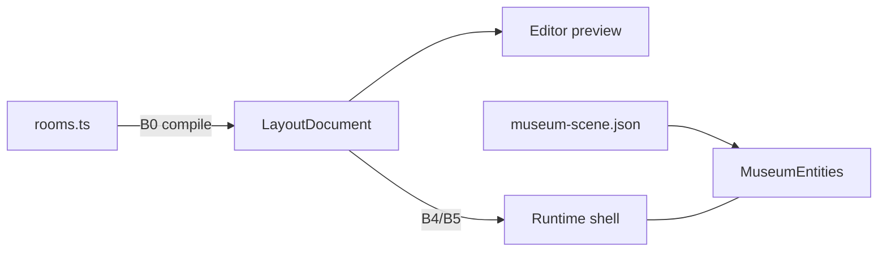

# Architecture

**Read when:** `rooms.ts`, layout CAD, promotion/cutover, ownership disputes.  
**Skip if:** only editing a scene prop, material, or tour key inside existing rooms.  
**Last reviewed:** 2026-08-10  
**Hub:** [`README.md`](./README.md) · **Vision:** [`north-star.md`](./north-star.md)

---

## Ownership

| Concern | Today | Target |
|---------|-------|--------|
| Room poses, dims, openings, yaw | `rooms.ts` | `LayoutDocument` / `project.layout` |
| Editor layout drafts | `LayoutDocument` / `museum-layout.json` | → runtime after B4/B5 |
| Entities, nodes, paths, materials | `museum-scene.json` v6 | `project.scene` |
| Codec v1–v6 | `scene-codec.ts` | + project envelope |
| Resolve + generated endpoints | `scene.ts` | same |
| Shell cutouts | `MuseumShell` from rooms | from layout after cutover |
| Routes / curves | `camera-route` + `camera-motion` only | unchanged |
| Tour FSM | `museum-state.svelte.ts` | unchanged |
| Editor session | `museum-editor.svelte.ts` | + layout-tagged history ops |

**Camera** = 3D guided PerspectiveCamera, not webcam.

## Mode A vs B

| Mode | Meaning | Status |
|------|---------|--------|
| **A — Dressing** | Props inside fixed architecture | Supported; presets deferred |
| **B — Layout authorship** | Draw/relocate rooms in layout data | **North star**; P0 |

- Layout meshes = **previews** until B4/B5. No editor layout UI in visitor chunks.  
- Corridors = skinny **layout rooms** (or later open wall-strip).  
- Cutouts = segment-split; no real-time CSG.  
- **Do not** treat scene Wall presets as shell authorship.

## Corridor and opening decision

P0 models corridors as ordinary skinny `LayoutRoom` footprints, not a special corridor entity. A corridor may have two rectangular geometric cutouts in A1; this reuses room generation and avoids a second wall-strip system.

**Pros:** simplest MVP; same floor/wall/ceiling generation; future room containment and camera IDs; no corridor-specific renderer.  
**Cons:** A1 cutouts do not yet prove that two rooms connect; duplicated/shared wall geometry and portal semantics remain a B4 concern.

A1 openings are geometry-only. Never infer room adjacency from coordinate overlap. B4 adds explicit `connectsRoomIds: [string, string]` for interior doors/portals; windows remain unpaired. This keeps MVP simple without losing a clear semantic-adjacency seam.

## Hard don’ts

Dual nav graphs · persist `node:<id>:position` endpoints · wire `@portfolio/scroll-travel` casually · ship editor to prod visitors (`/dev/museum-editor` → 404).
