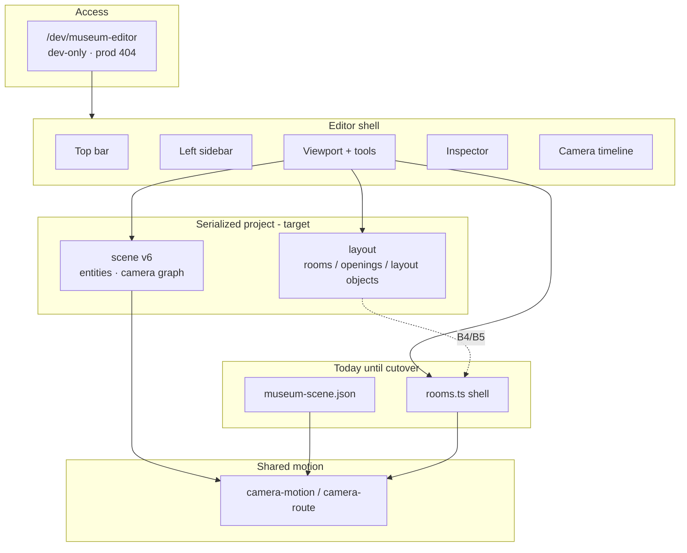

# Museum Editor — Durable Product Context

**Audience:** agents and humans planning or changing the editor.  
**North star:** [`north-star.md`](./north-star.md)  
**Live slice:** [`../agent-handoffs/CURRENT.md`](../agent-handoffs/CURRENT.md)  
**Not a release diary.** Workspace release history: [`../plans/museum-editor-workspace/README-museum-editor.md`](../plans/museum-editor-workspace/README-museum-editor.md).

**Last reviewed:** 2026-08-10

---

## How to use this folder

| If you are working on… | Read only |
|------------------------|-----------|
| Product vision / Chopin migration | [`north-star.md`](./north-star.md) |
| Orientation / what fits where | **This README** |
| Product definition (today → target) | [`product-overview.md`](./product-overview.md) |
| App chrome, Scene vs Camera | [`shell-and-workspaces.md`](./shell-and-workspaces.md) |
| Entities, assets, materials, clusters | [`scene-content.md`](./scene-content.md) |
| Ghosts, gizmos, scale, surfaces | [`placement-and-transforms.md`](./placement-and-transforms.md) |
| Tour graph, paths, timeline | [`camera-and-tour.md`](./camera-and-tour.md) |
| Schema v6, history, import/export | [`persistence-and-schema.md`](./persistence-and-schema.md) |
| `rooms.ts` vs layout authorship | [`architecture-boundary.md`](./architecture-boundary.md) |
| Track priority / deferred plans | [`roadmap-and-strategy.md`](./roadmap-and-strategy.md) |

Do **not** load every file for a narrow task.

---

## How the parts fit together

**Short explanation**

1. **North star:** layout-first complexes; Chopin becomes loadable data; camera on the whole complex.  
2. **Today:** visitor shell still from `rooms.ts`; scene/tour from v6 JSON; layout CAD is the P0 build.  
3. Scene + Camera workspaces share history (tagged ops); Layout mode authors architecture draft.  
4. One motion/graph pipeline; editor helpers never ship to visitors.  
5. Export/serialize; no automatic repo Save.

---

## Component index

| Doc | Owns |
|-----|------|
| [north-star](./north-star.md) | Vision, migration stages, track priority |
| [product-overview](./product-overview.md) | Scope, audiences, locked decisions |
| [shell-and-workspaces](./shell-and-workspaces.md) | 5-region UI |
| [scene-content](./scene-content.md) | Entities, library, materials |
| [placement-and-transforms](./placement-and-transforms.md) | Ghost, gizmos, scale |
| [camera-and-tour](./camera-and-tour.md) | Tour graph / timeline |
| [persistence-and-schema](./persistence-and-schema.md) | v6, I/O, history |
| [architecture-boundary](./architecture-boundary.md) | rooms.ts ↔ layout |
| [roadmap-and-strategy](./roadmap-and-strategy.md) | P0 / deferred |

---

## Agent update contract

Update the **matching component file** when contracts change; bump **Last reviewed**. Vision/priority → `north-star.md` + `roadmap-and-strategy.md` + `CURRENT.md`.

| Change type | Update |
|-------------|--------|
| Vision / Chopin migration / project envelope | `north-star.md`, `architecture-boundary.md` |
| Layout CAD vs scene dressing priority | `roadmap-and-strategy.md`, `CURRENT.md` |
| UI regions / workspaces / Layout mode | `shell-and-workspaces.md` |
| Entities / library / Paris gate | `scene-content.md` |
| Ghost / gizmo / scale / surfaces | `placement-and-transforms.md` |
| Tour / timeline / preview | `camera-and-tour.md` |
| Schema / I/O / history tags | `persistence-and-schema.md` |

Code entry: [`apps/museum/src/lib/editor/README.md`](../../apps/museum/src/lib/editor/README.md).

---

## Active implementation pointers

| Doc | Role |
|-----|------|
| [`../superpowers/plans/2026-08-10-layout-cad-foundation.md`](../superpowers/plans/2026-08-10-layout-cad-foundation.md) | **P0 plan** |
| [`../superpowers/reviews/2026-08-10-layout-cad-foundation-goal-alignment.md`](../superpowers/reviews/2026-08-10-layout-cad-foundation-goal-alignment.md) | Goal alignment review |
| [`../superpowers/plans/2026-08-09-museum-editor-full-track.md`](../superpowers/plans/2026-08-09-museum-editor-full-track.md) | Deferred dressing/GLB archaeology |
| [`../CAMERA_AND_LAYOUT.md`](../CAMERA_AND_LAYOUT.md) | Deep camera authoring |
| [`../../AGENTS.md`](../../AGENTS.md) | Repo contracts |
