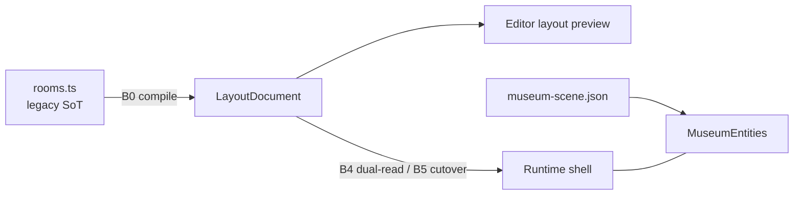

# Architecture boundary

**Read when:** rooms, walls, openings, layout CAD, Chopin migration, promotion.  
**Last reviewed:** 2026-08-10  
**North star:** [`north-star.md`](./north-star.md)

---

## Ownership (transition)

| Concern | Today | Target |
|---------|-------|--------|
| Room pose/size/openings | `rooms.ts` → `MuseumShell` | `LayoutDocument` / `project.layout` |
| Editor layout draft | — | `museum-layout.json` (editor); compile from `rooms.ts` (B0) |
| Props / lights / materials / tour | `museum-scene.json` v6 | `project.scene` |
| Runtime architecture source | Always `rooms.ts` | Flag `rooms.ts` \| `layout` then cutover |

---

## Mode A vs Mode B

| Mode | Definition | Status |
|------|------------|--------|
| **A — Dressing** | Props inside fixed architecture | Supported today; optional presets deferred |
| **B — Layout authorship** | Draw/relocate rooms in layout data; promote/load as shell | **North star**; layout CAD P0 |

Do **not** treat scene Wall presets as replacing `rooms.ts`. Do **not** teach agents that entity walls update portals/containment.

---

## Layout CAD boundary (foundation)

- Layout meshes are **previews** until B4/B5.  
- Visitor must not import editor layout UI modules.  
- Shared mesh factory extraction happens at promotion—not day one.  
- Cosmetic corridors: prefer skinny **layout rooms** (or later open wall-strip epic).
- Multi-story building stacks are a future track after the single-floor layout/complex quality gate; do not add floor links or vertical routing to the foundation.

---

## Cutouts

- Legacy shell: segment-split openings from `rooms.ts` (boolean-free).  
- Layout: same idea on draft segments.  
- Avoid real-time CSG.

---

## Update when

Architecture SoT, dual-read flag, cutover, or Mode A/B priority changes.
