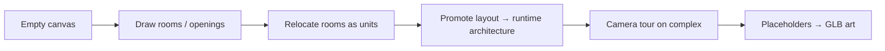

# Museum product north star

**Read when:** choosing what to build next; reviewing layout/CAD/scene pitches; migrating Chopin off code.  
**Last reviewed:** 2026-08-10  
**Live slice:** [`../agent-handoffs/CURRENT.md`](../agent-handoffs/CURRENT.md)

---

## Vision (one paragraph)

The product becomes a **layout-first museum complex editor**: empty canvas → draw and rearrange rooms → openings and placeholder shapes (not free mesh) → serialize the whole project → load it in editor and visitor → author the **camera tour on top of that complex**. Chopin is the first **data project**, not a permanent TypeScript special case. Many complexes can exist as serialized projects; the app is not a Blender competitor and not a multi-tenant CMS. The foundation is deliberately single-floor; multi-story buildings and stacked rooms begin only after the single-floor room/complex workflow is reliable, polished, and proven end to end.

---

## End-state shape

```text
MuseumProject (versioned)
  ├─ layout   ← rooms, boundaries, openings, layout objects  (today: rooms.ts)
  ├─ scene    ← entities, materials, textures, camera graph (today: museum-scene.json)
  └─ assets…  ← optional catalogue / imports
```



| Layer | Authoring | Runtime |
|-------|-----------|---------|
| Architecture | Layout CAD (`museum-layout.json` → project.layout) | Generated shell from layout (after cutover) |
| Content | Scene entities / placeholders / later GLBs | Same scene resolver path |
| Tour | Existing camera graph + motion | Unchanged pipeline; room IDs from layout |

### Expansion gate

**First prove one floor and one room/complex path completely:** draft, validate, preview in 3D, place content, serialize, reload, promote/load, and author the camera tour without regressions. Only after that gate passes should the layout hierarchy expand to:

```text
Building
  ├─ Floor 1 → rooms / openings / objects
  ├─ Floor 2 → rooms / openings / objects
  └─ vertical links → stairs / elevators / future connectors
```

Multi-story support is a future architecture track, not foundation scope. It must extend stable floor, room, opening, object, and camera IDs rather than retrofit them later.

---

## Sacred contracts

1. **Semantic drafting, not Blender** — points, segments, Bezier handles, dims, opening params. App owns mesh topology. No arbitrary vertex/edge/face editing, no general CSG.
2. **Serialize and load** — architecture leaves `rooms.ts` as source of truth; Chopin compiles into layout data, then projects load layout+scene together.
3. **One camera/motion system** — no second path engine; tour authors after (or beside) layout, never auto-rewritten by every wall tweak.
4. **Visitor isolation** — editor CAD modules stay out of visitor chunks until promotion APIs are explicitly shared.
5. **Incremental cutover** — dual-read flag (`rooms.ts` \| `layout`) before deleting code architecture.
6. **Click-to-place for objects** — ghost → commit; plan tools may use click-drag for rectangles as an explicit CAD exception.

---

## Migration story (Chopin → data)

| Stage | Chopin architecture | Visitor |
|-------|---------------------|---------|
| Today | `rooms.ts` | Shell from code |
| Foundation | Editor drafts `museum-layout.json`; compile `rooms.ts` → layout fixture | Still `rooms.ts` |
| Dual-read | Project can select layout source | Flagged projects use layout |
| Cutover | Chopin ships as project data | `rooms.ts` generated or removed |

Cosmetic corridors = skinny rooms or open wall strips in **layout**, not fake scene props pretending to be circulation—unless explicitly dressing-only.

---

## Active vs deferred tracks

| Priority | Track | Doc |
|----------|-------|-----|
| **P0** | Layout CAD foundation + Chopin compile + project envelope | [`../superpowers/plans/2026-08-10-layout-cad-foundation.md`](../superpowers/plans/2026-08-10-layout-cad-foundation.md) |
| **P1** | Room-unit relocate; runtime layout reader; cutover | Same plan Tracks B/C |
| **P2** | GLB import / cross-room art (former full-track Phase 3) | Deferred until layout-backed complex is loadable |
| **P3** | Scene “architecture presets” as props (former full-track Phase 2) | Optional dressing; **not** the path to authored shell |
| **P4** | Multi-story buildings / stacked rooms | Begin only after single-floor layout + serialized complex passes its quality gate |
| — | Shell multi-opening polish on legacy `rooms.ts` | Avoid investing if cutover is near |

---

## Non-goals

- General-purpose mesh editor / sculpt / UV workflows  
- Auto camera collision or auto tour from floorplan  
- Multi-floor / terrain / civil CAD in the single-floor foundation; multi-story buildings are a later gated track  
- Multi-project cloud CMS (local/serialized many-projects is enough)  
- Replacing camera timeline/graph with a new system  

---

## Update when

Vision, sacred contracts, migration stages, or track priority change. Keep day-to-day slice status in `CURRENT.md` only.
